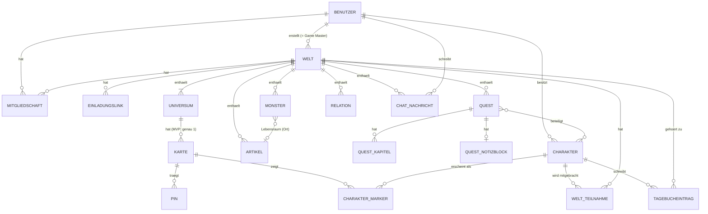

# Fachliches Datenmodell (MVP)

**Status:** Freigegeben durch den Projektinhaber am 2026-09-22. Alle offenen Fragen (Abschnitt 7) sind geklärt. Änderungen nur nach erneuter Abstimmung mit dem Projektinhaber.
**Änderung 2026-09-22 (Plan-Review 001, abgestimmt mit dem Projektinhaber):** Rollen ändern und Mitglieder entfernen darf nur der Game Master, nicht mehr die gesamte Spielleitung (3.3, Abschnitt 5). Austreten und Entfernen löschen nichts mehr: Mitgliedschaft, Welt-Teilnahmen, Marker und Relationen werden archiviert und bei erneutem Beitritt wiederhergestellt (3.3, 3.4, 3.9, 3.10, Abschnitt 4). Universen werden Teil des Beziehungsnetzes: erwähnbar über `@`, Quelle (über Erwähnungen in ihrer Beschreibung) und Ziel von Relationen. Die Welt bleibt reines logisches Objekt ohne Erwähnungen und Relationen (2.1, 2.3, 2.4, 2.5, 3.2, 3.14, Abschnitt 4). Das Konzept „aktiver Charakter“ entfällt: Ein Benutzer kann mehrere mitgebrachte Charaktere gleichzeitig spielen, jeder mitgebrachte Charakter kann Marker haben (3.9, 3.10, Abschnitt 5).
**Änderung 2026-09-23 (Plan `004`, abgestimmt mit dem Projektinhaber):** Dreistufige Sichtbarkeit (`nur ich` / `nur Spielleitung` / `veröffentlicht`) mit Owner für Artikel, Quests, Quest-Kapitel und Pins; Universen und Karten bleiben zweistufig (Karten-Ausnahme). Quest-Kapitel und Quest-Notizblock neu (3.13a, 3.13b). Owner-Rechte ruhen bei herabgestufter Rolle Player; `nur ich` setzen darf nur der Owner. Erwähnungen aus veröffentlichten Kapiteln erzeugen Relationen der Quest; Notizblock ohne Relationen.
**Änderung 2026-09-23 (Plan `005`, Entscheidungen M1–M7):** Monster als eigener Inhaltstyp (Bestiarium), kein Artikel. Volles Charakterblatt wie 3.8 plus Art, Seltenheit, Legendär, Gefahrenstufe, Größe, Lebensraum; genau ein Profilbild; dreistufige Sichtbarkeit und Owner wie Artikel; vollwertig in Relationen, Erwähnungen und Suche (Bio mit `@` erlaubt, anders als Charakter). Siehe 3.8a.
**Bezug:** Plan `001-mvp-infrastruktur.md` (F1–F10, Rechtematrix); Plan `004-quest-kapitel-und-owner-sichtbarkeit.md`; Plan `005-monster-bestiarium.md`.

Dieses Dokument beschreibt, **welche Dinge es gibt, welche Eigenschaften sie haben, wie sie zusammenhängen und welche Regeln gelten**, unabhängig von Datenbank und Backend. Datentypen sind fachlich gemeint (z. B. „Text, max. 120 Zeichen“), nicht technisch.

---

## 1. Überblick

Relationen verbinden Artikel, Quests, Charaktere, Pins, Universen und Monster beliebig miteinander (Inhaltsverweis, siehe 2.1). Sie sind im Diagramm nur als Zugehörigkeit zur Welt dargestellt.

**Leseregel:** Alles außer Benutzer und Charakter gehört (direkt oder indirekt) zu genau einer Welt. Wird eine Welt gelöscht, verschwindet alles, was zu ihr gehört. Charaktere gehören dem Benutzer und überleben das Löschen einer Welt. Monster gehören zur Welt und werden mit ihr gelöscht.

---

## 2. Querschnittliche Konzepte

### 2.1 Inhaltsverweis

Mehrere Stellen verweisen auf „einen Inhalt der Welt“ (Pins, Relationen, Erwähnungen). Ein **Inhaltsverweis** besteht aus:

| Feld | Werte |
|---|---|
| Art | `artikel`, `quest`, `charakter`, `pin`, `universum`, `monster` |
| Ziel | der konkrete Artikel, die Quest, der Charakter, der Pin, das Universum oder das Monster |

Regeln:
- Das Ziel muss zur selben Welt gehören (bei Charakteren: in diese Welt mitgebracht sein; Monster gehören direkt zur Welt).
- Pins können Quelle einer Relation sein (über Erwähnungen in ihrer Beschreibung) und Ende einer manuellen Relation. Über `@` erwähnbar sind sie **nicht** (siehe 2.4).
- Universen sind über `@` erwähnbar, können Quelle einer Relation sein (über Erwähnungen in ihrer Beschreibung) und Quelle oder Ziel einer manuellen Relation.
- Monster sind über `@` erwähnbar, Quelle (Bio-Erwähnungen, Lebensraum-Feld) und Ziel von Relationen (Plan `005`, M5).
- Die **Welt** ist kein Inhaltsverweis: Sie ist nur das logische Objekt (die Gruppe) für die Geschichte, nicht erwähnbar und nie Quelle oder Ziel einer Relation.

### 2.2 Sichtbarkeitsstatus

Es gibt zwei Varianten (Plan `004`, 2026-09-23):

**Dreistufig** (`content_visibility`) für **Artikel, Quests, Quest-Kapitel, Pins und Monster**:

| Wert (UI) | Schlüssel (DB) | Bedeutung |
|---|---|---|
| `veröffentlicht` | `published` | Alle Mitglieder der Welt sehen den Inhalt. |
| `nur Spielleitung` | `gm_only` | Nur Game Master und Master sehen den Inhalt. |
| `nur ich` | `owner_only` | Nur der **Owner** sieht den Inhalt — und nur, solange er Spielleitung ist. Der Game Master sieht fremde `nur ich`-Inhalte nicht. Ein zum Player herabgestufter früherer Master sieht auch seine eigenen `nur ich`-Inhalte nicht (Owner-Rechte ruhen komplett; nach erneuter Hochstufung wieder da; keine Datenänderung beim Rollenwechsel). |

**Zweistufig** (`visibility_status`) für **Universen und Karten** (**Karten-Ausnahme**): nur `veröffentlicht` / `nur Spielleitung`. Kein Owner, kein `nur ich`.

**Owner:** Jeder Artikel, jede Quest, jedes Quest-Kapitel, jeder Pin und jedes Monster hat einen Owner (Benutzer). Beim Anlegen wird der anlegende Benutzer Owner. Owner und `erstellt von` sind getrennt, damit ein späteres Übertragen möglich bleibt. Was passiert, wenn der Owner die Welt verlässt, steht im Backlog.

Regeln:
- **Standardwert neu:** Artikel, Quest, Quest-Kapitel, Pin, Monster → `nur ich`. Universum und Karte → `nur Spielleitung` (unverändert); Ausnahme: das automatisch angelegte erste Universum ist `veröffentlicht`.
- Bestandsdaten behalten ihren bisherigen Wert; `owner` wird aus `erstellt von` befüllt.
- **`nur ich` setzen** darf nur der Owner. Andere Spielleiter wechseln bei fremden Datensätzen nur zwischen `nur Spielleitung` und `veröffentlicht`.
- **Vererbung nach unten:** Ein Inhalt ist nur sichtbar, wenn auch alles darüber sichtbar ist. Ist ein Universum `nur Spielleitung`, sehen Player weder seine Karten noch deren Pins und Charakter-Marker, unabhängig von deren eigenem Status. Dasselbe gilt für eine versteckte Karte und ihre Pins. Neu: Kapitel nur sichtbar, wenn die Quest sichtbar ist; Notizblock nur, wenn die Quest sichtbar ist.
- Das Veröffentlichen eines Universums veröffentlicht nicht automatisch seine Karten oder Pins. Dasselbe gilt für Quest und Kapitel: jedes Kapitel behält seinen eigenen Status.

### 2.3 Rich-Text

Formatierter Text aus dem Artikel-Editor (TipTap) mit dem in Plan 001 festgelegten Funktionsumfang, inkl. Erwähnungen (`@Name`) als Inhaltsverweise. Wird zusätzlich als Klartext für die Suche vorgehalten. Rich-Text wird verwendet für: Weltbeschreibung (**ohne** Erwähnungen), Universumsbeschreibung, Artikelinhalt, Questbeschreibung, Quest-Kapitelinhalt, Quest-Notizblock, Pinbeschreibung, Charakter-Bio (im MVP **ohne** Erwähnungen, siehe 3.8), Monster-Bio (**mit** Erwähnungen, siehe 3.8a) und Tagebucheinträge.

### 2.4 Erwähnung & Erwähnungssuche

Eine **Erwähnung** ist ein Inhaltsverweis mitten im Rich-Text, z. B.:

> Hier findet man den **@Gottschleim**. Du musst einen für die Quest **@Töte den Gottschleim** erlegen.

**Erwähnungssuche** (beim Tippen von `@` im Editor):
- Durchsucht die Titel bzw. Namen aller **Artikel, Quests, Charaktere, Universen und Monster** der Welt, die der schreibende Benutzer sehen darf.
- Treffer bei **Teilwort, ohne Beachtung der Groß-/Kleinschreibung**: `@Schleim` findet „Gottschleim“ (Artikel) und „Töte den Gottschleim“ (Quest).
- Jeder Vorschlag zeigt die **Kategorie** (`Artikel`, `Quest`, `Charakter`, `Universum`, `Monster`), bei Artikeln zusätzlich den Vorlagentyp (z. B. „Artikel · Ort“).
- Höchstens 10 Vorschläge, sortiert: Treffer am Wortanfang vor Treffern mitten im Wort, danach alphabetisch.
- Monster sind **nicht** als Stub per `@` neu anlegbar (Stub-Artikel bleiben Artikel).

**Anzeige:** Eine Erwähnung erscheint als Link mit dem **aktuellen** Titel des Ziels (ein Umbenennen des Ziels aktualisiert alle Erwähnungen). Darf der Leser das Ziel nicht sehen oder existiert es nicht mehr, erscheint der zuletzt bekannte Titel als normaler Text ohne Link.

### 2.5 Verknüpfte Elemente

Jeder Artikel, jede Quest, jeder Charakter, jeder Pin, jedes Universum und jedes Monster zeigt einen Bereich **„Verknüpft“** mit allen Relationen, ein- und ausgehend, die der Betrachter sehen darf. Gruppiert nach Kategorie:

| Gruppe | Anzeige | Klick führt zu |
|---|---|---|
| Pins | Pin-Typ-Icon, Titel, Name der Karte | der Karte, zentriert und gezoomt auf die Koordinaten des Pins; der Pin ist hervorgehoben |
| Artikel | Titel, untergruppiert nach Vorlagentyp (z. B. „Orte“, „Personen“) | dem Artikel |
| Quests | Titel, Status | der Quest |
| Charaktere | Porträt, Name | dem Charakter |
| Universen | Name | dem Universum |
| Monster | Profilbild/Initialen, Name, Seltenheits-Pill | dem Monster |

Bei manuellen Relationen wird zusätzlich deren Bezeichnung angezeigt (siehe 3.14).

### 2.6 Protokollfelder

Alle von Benutzern bearbeitbaren Inhalte tragen: **erstellt am**, **erstellt von** (Benutzer), **geändert am**, **geändert von** (Benutzer). Sie sind in den Tabellen unten nicht jedes Mal wiederholt.

### 2.7 Relative Position

Positionen auf einer Karte werden als Paar (x, y) gespeichert, jeweils eine Dezimalzahl von 0 bis 1, relativ zu Breite und Höhe des Kartenbilds (0/0 = oben links). Damit bleiben Positionen gültig, unabhängig von Zoomstufe, Bildschirmgröße und Auflösung des Kartenbilds.

**Genauigkeit:** mindestens 6 Nachkommastellen. Das ergibt Pixelgenauigkeit bis zu einer Bildkantenlänge von 1.000.000 px und erlaubt pixelgenaues Verschieben auch bei stark vergrößerter Ansicht. Eine gröbere Speicherung (z. B. 3 Nachkommastellen) ist ausgeschlossen: Bei einem 8000 px breiten Bild entspräche sie Sprüngen von 8 px.

---

## 3. Entitäten

### 3.1 Benutzer

Wird beim ersten Discord-Login angelegt.

| Eigenschaft | Typ | Pflicht | Regel |
|---|---|:-:|---|
| Discord-ID | Text | ✅ | eindeutig |
| Anzeigename | Text, max. 100 | ✅ | bei jedem Login aus Discord aktualisiert |
| Avatar | URL | – | bei jedem Login aus Discord aktualisiert |
| E-Mail | E-Mail | – | nur falls Scope `email` genutzt wird |
| Registriert am | Zeitpunkt | ✅ | |
| Letzter Login | Zeitpunkt | ✅ | |

### 3.2 Welt

| Eigenschaft | Typ | Pflicht | Regel |
|---|---|:-:|---|
| Name | Text, max. 120 | ✅ | |
| Beschreibung | Rich-Text ohne Erwähnungen | – | |
| Titelbild | Bild (JPG/PNG/WebP, max. 10 MB) | – | |
| Ersteller | Benutzer | ✅ | unveränderlich; ist der Game Master |

Regeln:
- Beim Erstellen entstehen automatisch: eine Mitgliedschaft des Erstellers mit Rolle `Game Master` und ein erstes Universum (Name „Hauptuniversum“, umbenennbar).
- Eine Welt hat immer mindestens ein Universum.

### 3.3 Mitgliedschaft

Verbindet Benutzer und Welt.

| Eigenschaft | Typ | Pflicht | Regel |
|---|---|:-:|---|
| Welt | Welt | ✅ | |
| Benutzer | Benutzer | ✅ | pro Welt höchstens eine Mitgliedschaft |
| Rolle | `Game Master` / `Master` / `Player` | ✅ | |
| Beigetreten am | Zeitpunkt | ✅ | |
| Beigetreten über | Einladungslink | – | leer beim Ersteller |
| Archiviert am | Zeitpunkt | – | gesetzt = Mitgliedschaft ruht (Benutzer ist ausgetreten oder wurde entfernt) |

Regeln:
- `Game Master` hat genau der Ersteller der Welt, niemand sonst. Seine Mitgliedschaft kann weder geändert noch entfernt werden.
- Neue Mitglieder erhalten immer `Player`.
- Rollen ändern (Player ↔ Master) und Mitglieder entfernen darf nur der Game Master. Das Austreten aus einer Welt steht jedem Mitglied außer dem Game Master frei.
- Austreten und Entfernen **löschen nichts**, sondern archivieren die Mitgliedschaft (siehe Abschnitt 4). Ein Benutzer mit archivierter Mitgliedschaft gilt in allen Rechteprüfungen als Nicht-Mitglied.

### 3.4 Einladungslink

| Eigenschaft | Typ | Pflicht | Regel |
|---|---|:-:|---|
| Welt | Welt | ✅ | |
| Code | geheimer Zufallswert | ✅ | eindeutig, nicht erratbar |
| Widerrufen am | Zeitpunkt | – | gesetzt = ungültig |
| Gültigkeit | `1 Tag` / `7 Tage` / `unbegrenzt` | ✅ | beim Erstellen gewählt (OF-01) |
| Gültig bis | Zeitpunkt | – | aus der Gültigkeit berechnet; leer bei `unbegrenzt` |
| Bisherige Nutzungen | Zahl | ✅ | nur zur Anzeige |

Regeln:
- Nur der Game Master erstellt und widerruft Einladungslinks.
- Eine Welt kann mehrere gleichzeitig gültige Links haben. Die Anzahl der Nutzungen ist nicht begrenzt.
- Ein Link ist gültig, solange er nicht widerrufen und nicht abgelaufen ist.
- Öffnet ein angemeldeter Benutzer einen gültigen Link und ist noch kein Mitglied, wird er Player. Hat er eine archivierte Mitgliedschaft, wird diese reaktiviert (Archiviert am wird geleert, Rolle `Player`). Ist er bereits Mitglied, passiert nichts.

### 3.5 Universum

| Eigenschaft | Typ | Pflicht | Regel |
|---|---|:-:|---|
| Welt | Welt | ✅ | |
| Name | Text, max. 120 | ✅ | eindeutig innerhalb der Welt |
| Beschreibung | Rich-Text | – | |
| Reihenfolge | Zahl | ✅ | für die Anzeige, per Drag & Drop änderbar |
| Sichtbarkeit | Sichtbarkeitsstatus | ✅ | Standard `nur Spielleitung`; Ausnahme: das automatisch angelegte erste Universum ist `veröffentlicht` |

### 3.6 Karte

| Eigenschaft | Typ | Pflicht | Regel |
|---|---|:-:|---|
| Universum | Universum | ✅ | |
| Name | Text, max. 120 | ✅ | |
| Kartenbild | Bild (JPG/PNG/WebP, max. 20 MB) | ✅ | |
| Bildbreite, Bildhöhe | Zahl (px) | ✅ | beim Hochladen ermittelt |
| Sichtbarkeit | Sichtbarkeitsstatus | ✅ | Standard `nur Spielleitung` |

Regeln:
- **Produkt (2026-09-23):** mehrere Karten pro Universum; Pins pro Karte; Charakter-Marker höchstens eine Karte weltweit.
- Wird das Kartenbild ersetzt, bleiben Pins und Marker an ihrer relativen Position.

### 3.7 Pin

| Eigenschaft | Typ | Pflicht | Regel |
|---|---|:-:|---|
| Karte | Karte | ✅ | |
| Pin-Typ | einer der 12 Pin-Typen | ✅ | |
| Titel | Klartext, max. 120 | ✅ | enthält keine Erwähnungen |
| Beschreibung | Rich-Text | – | darf leer sein; im Popup angezeigt; **einziger Ort** für Erwähnungen am Pin, die ihn mit beliebig vielen Artikeln, Quests und Charakteren verknüpfen (OF-09) |
| Position | relative Position | ✅ | |
| Owner | Benutzer | ✅ | anlegender Benutzer; unveränderlich im MVP |
| Sichtbarkeit | dreistufig (2.2) | ✅ | Standard `nur ich` |
| Gesperrt | ja/nein | ✅ | Standard `nein`. Nur die Spielleitung sperrt und entsperrt. Ein gesperrter Pin lässt sich weder verschieben noch bearbeiten noch löschen, auch nicht durch die Spielleitung. Erlaubt ist nur das Entsperren. Mitglieder sehen gesperrte Pins normal, mit Schloss-Symbol (Entscheidung Projektinhaber 2026-09-22, Code-Review Plan 001 CR-020) |

### 3.8 Charakter

Gehört einem Benutzer, unabhängig von Welten.

| Eigenschaft | Typ | Pflicht | Regel |
|---|---|:-:|---|
| Besitzer | Benutzer | ✅ | unveränderlich |
| Name | Text, max. 120 | ✅ | |
| Profilbild | Bild (JPG/PNG/WebP, max. 10 MB) | – | wird auch als Charakter-Marker verwendet; ohne Bild: Platzhalter mit Initialen |
| Klasse | Text, max. 60 | – | Freitext (OF-07) |
| Attribute | je eine Ganzzahl 1–30 für Stärke, Geschicklichkeit, Konstitution, Intelligenz, Weisheit, Charisma | – | der Modifikator wird nur angezeigt, nicht gespeichert: abgerundet((Wert − 10) / 2) |
| Fertigkeiten | geordnete Liste; pro Fertigkeit: Name (Text, max. 60), Übungsgrad `untalentiert` / `ungeübt` / `geübt` / `Expertise`, skalierendes Attribut (eines der sechs) | – | frei vom Besitzer angelegt, keine feste D&D-Liste; neuer Charakter startet mit leerer Liste; höchstens 30 Fertigkeiten; Name pro Charakter eindeutig (ohne Beachtung von Groß-/Kleinschreibung); angezeigt wird der Gesamtbonus = Modifikator des skalierenden Attributs + Aufschlag nach Übungsgrad: `untalentiert` −4 (fest), `ungeübt` −2 (fest), `geübt` + Übungsbonus, `Expertise` + 2 × Übungsbonus; bei Übungsbonus +2 also −4 / −2 / +2 / +4. Der Gesamtbonus wird nur angezeigt, nicht gespeichert (Entscheidung Projektinhaber 2026-09-22) |
| Übungsbonus | Ganzzahl 0–10 | ✅ | Standard +2; vom Besitzer frei gesetzt, nicht aus einer Stufe berechnet |
| Fähigkeiten | geordnete Liste; pro Fähigkeit: Text (max. 120), skalierendes Attribut (eines der sechs) | – | frei vom Besitzer angelegt; kein Übungsgrad, kein Übungsbonus; angezeigt wird nur der Modifikator des skalierenden Attributs (nicht gespeichert); neuer Charakter startet mit leerer Liste; höchstens 30; Text pro Charakter eindeutig (ohne Beachtung von Groß-/Kleinschreibung) (Entscheidung Projektinhaber 2026-09-22) |
| Persönlichkeitsmerkmale | Text, max. 1000 | – | |
| Ideale | Text, max. 1000 | – | |
| Bindungen | Text, max. 1000 | – | |
| Makel | Text, max. 1000 | – | |
| Bio | Rich-Text | – | Hintergrundgeschichte, Aussehen usw.; im MVP **ohne** Erwähnungen (`@` ist ein normales Zeichen), weil ein Charakter keiner Welt gehört und die Suche eine Welt bräuchte (Entscheidung Projektinhaber 2026-09-23, Plan 003 T-008; Erwähnungen mit Relationen später, siehe Backlog) |
| Bildanhänge | Liste von Bildern (JPG/PNG/WebP, je max. 10 MB, höchstens 10) mit optionaler Bildunterschrift (Text, max. 200) | – | Reihenfolge änderbar |

Bewusst **nicht** enthalten (OF-08): Volk, Stufe, Trefferpunkte, Rüstungsklasse, Rettungswürfe, Inventar, Zauber. (Der Übungsbonus ist seit 2026-09-22 enthalten, siehe oben.)

Regel: Nur der Besitzer bearbeitet seinen Charakter. Mitglieder einer Welt sehen alle in diese Welt mitgebrachten Charaktere mit allen oben genannten Eigenschaften.

### 3.8a Monster

Gehört zu einer Welt (nicht zum Benutzer). Eigener Inhaltstyp, **kein** Artikel (Entscheidung M1, Plan `005`, 2026-09-23).

**Unterschiede zu Charakter (3.8):** Welt-Bindung statt Benutzer-Besitz; Bio **mit** Erwähnungen (`@`); genau ein Profilbild statt Bildanhängen; zusätzlich monsterspezifische Felder (Art, Seltenheit, Legendär, Gefahrenstufe, Größe, Lebensraum); Owner und dreistufige Sichtbarkeit wie Artikel (M4).

| Eigenschaft | Typ | Pflicht | Regel |
|---|---|:-:|---|
| Welt | Welt | ✅ | |
| Name | Text, max. 120 | ✅ | |
| Profilbild | Bild (JPG/PNG/WebP, max. 10 MB) | – | genau eines; ohne Bild: Platzhalter mit Initialen; dient in Phase 2 als Marker-Bild |
| Klasse | Text, max. 60 | – | wie Charakter (3.8) |
| Attribute | je eine Ganzzahl 1–30 für Stärke, Geschicklichkeit, Konstitution, Intelligenz, Weisheit, Charisma | – | wie Charakter |
| Fertigkeiten | geordnete Liste wie Charakter | – | wie Charakter (max. 30) |
| Übungsbonus | Ganzzahl 0–10 | ✅ | Standard +2 |
| Fähigkeiten | geordnete Liste wie Charakter | – | wie Charakter (max. 30) |
| Persönlichkeitsmerkmale | Text, max. 1000 | – | |
| Ideale | Text, max. 1000 | – | |
| Bindungen | Text, max. 1000 | – | |
| Makel | Text, max. 1000 | – | |
| Bio | Rich-Text | – | **mit** Erwähnungen; erzeugen Relationen (`Erwähnung`) |
| Art | `beast` Bestie / `undead` Untoter / `demon` Dämon / `dragon` Drache / `humanoid` Humanoid / `construct` Konstrukt / `aberration` Aberration / `plant` Pflanze / `magical` Magisch / `other` sonstiges | ✅ | Standard `other` |
| Seltenheit | `common` Common / `uncommon` Uncommon / `rare` Rare / `epic` Epic / `legendary` Legendary | ✅ | Standard `common`; Anzeige als farbige Pill (Labels englisch) |
| Legendär | Ja/Nein | ✅ | Standard Nein; unabhängig von der Seltenheit |
| Gefahrenstufe | `harmless` Harmlos / `dangerous` Gefährlich / `deadly` Tödlich / `devastating` Verheerend / `divine` Göttlich / `apocalyptic` Apokalyptisch | ✅ | Standard `harmless` |
| Größe | `tiny` Winzig / `small` Klein / `medium` Durchschnitt / `large` Groß / `gigantic` Gigantisch | ✅ | Standard `medium`; Hinweis zu `medium`: „ca. 1,50 m Schulterhöhe“ |
| Lebensraum | Verweis auf Artikel derselben Welt mit Vorlage `place` | – | erzeugt Relation Monster → Ort mit Herkunft `Vorlagenfeld`, Feld `habitat` |
| Owner | Benutzer | ✅ | anlegender Benutzer; unveränderlich im MVP |
| Sichtbarkeit | dreistufig (2.2) | ✅ | Standard `nur ich` |

Bewusst **nicht** enthalten (wie OF-08 bei Charakteren): Trefferpunkte, Rüstungsklasse, Kampfwerte. Keine mehreren Bildanhänge.

Regel: Anlegen nur Spielleitung; Bearbeiten und Löschen durch Owner und Spielleitung, sofern sie das Monster sehen (E10, R1, R2 aus Plan `004` sinngemäß).

### 3.9 Welt-Teilnahme

Ein Charakter, der in eine Welt mitgebracht wurde.

| Eigenschaft | Typ | Pflicht | Regel |
|---|---|:-:|---|
| Charakter | Charakter | ✅ | |
| Welt | Welt | ✅ | pro Charakter und Welt höchstens eine Teilnahme |
| Mitgebracht am | Zeitpunkt | ✅ | |
| Archiviert am | Zeitpunkt | – | gesetzt = Teilnahme ruht (siehe Löschregeln, OF-05) |

Regeln:
- Der Besitzer des Charakters muss (nicht archiviertes) Mitglied der Welt sein, solange die Teilnahme nicht archiviert ist.
- Ein Benutzer kann beliebig viele eigene Charaktere in dieselbe Welt mitbringen und gleichzeitig spielen. Einen Aktiv-Schalter gibt es nicht.
- Ist eine Teilnahme archiviert, sind der Charakter und seine Tagebucheinträge dieser Welt für niemanden in der Welt sichtbar, auch nicht für die Spielleitung.
- Bringt der Besitzer denselben Charakter nach einem erneuten Beitritt wieder mit, wird die archivierte Teilnahme reaktiviert (Archiviert am wird geleert). Damit sind die früheren Tagebucheinträge wieder da.

### 3.10 Charakter-Marker

| Eigenschaft | Typ | Pflicht | Regel |
|---|---|:-:|---|
| Charakter | Charakter | ✅ | |
| Karte | Karte | ✅ | pro Charakter und Karte höchstens ein Marker |
| Position | relative Position | ✅ | |

Regeln (OF-04):
- Marker entstehen **nicht automatisch**. Der Besitzer platziert einen seiner mitgebrachten Charaktere bewusst auf einer Karte, oder die Spielleitung platziert ihn dort. Der Besitzer kann dafür nur Karten wählen, die er sehen darf.
- Ein Charakter kann auf mehreren Karten einen Marker haben, pro Karte höchstens einen.
- Besitzer und Spielleitung können einen Marker verschieben und von der Karte entfernen (= Marker löschen).
- Angezeigt werden die Marker aller Charaktere mit nicht archivierter Teilnahme an der Welt der Karte. Soll ein Charakter nicht mehr auf der Karte erscheinen, wird sein Marker entfernt.

### 3.11 Artikel

| Eigenschaft | Typ | Pflicht | Regel |
|---|---|:-:|---|
| Welt | Welt | ✅ | |
| Titel | Text, max. 200 | ✅ | |
| Vorlagentyp | `ohne Vorlage` oder ein Vorlagentyp | ✅ | nach dem Anlegen änderbar; nicht passende Vorlagenfelder werden dabei verworfen (mit Warnung) |
| Vorlagenfelder | Werte je nach Vorlagentyp (siehe 3.12) | – | |
| Titelbild | Bild (JPG/PNG/WebP, max. 10 MB) | – | |
| Inhalt | Rich-Text | – | |
| Owner | Benutzer | ✅ | anlegender Benutzer; unveränderlich im MVP |
| Sichtbarkeit | dreistufig (2.2) | ✅ | Standard `nur ich` |

### 3.12 Vorlagentyp (Konfiguration, keine Benutzerdaten)

Vorlagentypen werden im MVP **im Code definiert**, nicht von Benutzern angelegt. Jeder Vorlagentyp besteht aus einer Liste von Feldern:

| Eigenschaft eines Feldes | Werte |
|---|---|
| Schlüssel | technischer Name, z. B. `herrscher` |
| Bezeichnung | Anzeigename, z. B. „Herrscher“ |
| Feldart | `Text`, `Zahl`, `Auswahl` (feste Liste), `Verweis` (Inhaltsverweis, einer), `Verweisliste` (mehrere Inhaltsverweise) |
| Erlaubte Verweisziele | nur bei Verweis-Feldern, z. B. „nur Artikel vom Typ Person“ |

Konkrete Vorlagentypen und Felder legt der MVP-Funktionsplan fest. Das Modell muss neue Vorlagentypen ohne Schemaänderung aufnehmen können.

### 3.13 Quest

| Eigenschaft | Typ | Pflicht | Regel |
|---|---|:-:|---|
| Welt | Welt | ✅ | |
| Titel | Text, max. 200 | ✅ | |
| Beschreibung | Rich-Text | – | |
| Status | `offen` / `aktiv` / `abgeschlossen` / `gescheitert` | ✅ | Standard: `offen` |
| Beteiligte Charaktere | Liste von Charakteren | – | nur in diese Welt mitgebrachte Charaktere; pro Beteiligung wird zusätzlich der Charaktername als Text festgehalten (bleibt nach Löschen des Charakters sichtbar, OF-05) |
| Owner | Benutzer | ✅ | anlegender Benutzer; unveränderlich im MVP |
| Sichtbarkeit | dreistufig (2.2) | ✅ | Standard `nur ich` |

Anmerkung: Ein eigenes Feld „Auftraggeber“ gibt es nicht. Auftraggeber, Orte und weitere Bezüge entstehen über Erwähnungen in der Beschreibung oder über manuelle Relationen (OF-10). Die Quest-Beschreibung bleibt die Einleitung; darunter folgen Kapitel (3.13a). Quests ohne Kapitel funktionieren wie bisher.

### 3.13a Quest-Kapitel

Abschnitt einer Quest. Kein Branching, keine erzwungene Freigabe-Reihenfolge; die Position ist nur Anzeigereihenfolge (Lücken erlaubt).

| Eigenschaft | Typ | Pflicht | Regel |
|---|---|:-:|---|
| Quest | Quest | ✅ | |
| Titel | Text, max. 200 | ✅ | 1–200 Zeichen |
| Inhalt | Rich-Text | – | |
| Position | Zahl | ✅ | Anzeigereihenfolge innerhalb der Quest |
| Owner | Benutzer | ✅ | anlegender Benutzer; unveränderlich im MVP |
| Sichtbarkeit | dreistufig (2.2) | ✅ | Standard `nur ich`; Freigabe = auf `veröffentlicht` setzen |

Regeln:
- Sichtbar nur, wenn auch die Quest sichtbar ist (Vererbung).
- Erwähnungen erzeugen Relationen der **Quest** nur aus Kapiteln mit Sichtbarkeit `veröffentlicht` (siehe 3.14).
- Player-Nummerierung zählt nur die für den Betrachter sichtbaren Kapitel fortlaufend (verrät keine versteckten).

### 3.13b Quest-Notizblock

Genau ein gemeinsamer Rich-Text pro Quest für alle Mitglieder, die die Quest sehen.

| Eigenschaft | Typ | Pflicht | Regel |
|---|---|:-:|---|
| Quest | Quest | ✅ | höchstens eine Zeile pro Quest |
| Inhalt | Rich-Text | – | |
| Version | Zahl | ✅ | Standard 0; bei jedem Speichern um 1 erhöht |
| Geändert am / von | Zeitpunkt / Benutzer | ✅ | |

Regeln:
- Lesen und Schreiben: alle Mitglieder, die die Quest sehen. Kein eigener Owner.
- Speichern mit Versionsprüfung: weicht die mitgeschickte Version von der gespeicherten ab, wird nicht gespeichert (Konflikt; Hinweis „Neu laden“).
- Erwähnungen werden verlinkt angezeigt, erzeugen **keine** Relationen (wie Tagebuch).
- Nicht Teil der Kampagnen-Hub-Suche.

### 3.14 Relation

Gerichtete Verbindung zwischen zwei Inhalten. Es gibt zwei Sorten (OF-06):
- **Automatische Relationen** werden aus den Inhalten abgeleitet und nie direkt bearbeitet.
- **Manuelle Relationen** legt die Spielleitung direkt an, mit einer eigenen Bezeichnung (z. B. „ist verfeindet mit“, „ist Auftraggeber von“).

| Eigenschaft | Typ | Pflicht | Regel |
|---|---|:-:|---|
| Welt | Welt | ✅ | |
| Quelle | Inhaltsverweis | ✅ | |
| Ziel | Inhaltsverweis | ✅ | Quelle ≠ Ziel |
| Herkunft | siehe unten | ✅ | |
| Feld | Schlüssel des Vorlagenfelds | – | nur bei Herkunft `Vorlagenfeld` |
| Bezeichnung | Text, max. 60 | – | Pflicht bei Herkunft `manuell`, sonst leer |
| Gegenbezeichnung | Text, max. 60 | – | nur bei `manuell`: Anzeige aus Sicht des Ziels (z. B. „ist Auftraggeber von“ ↔ „hat Auftraggeber“); leer = dieselbe Bezeichnung in beide Richtungen |

**Herkunft** und woraus sie entsteht:

| Herkunft | Entsteht aus |
|---|---|
| `Erwähnung` | `@Name` im Rich-Text eines Artikels, einer Quest (Beschreibung), eines **veröffentlichten** Quest-Kapitels (Quelle = Quest), eines Pins, eines Charakters, eines Universums oder eines Monsters (Bio) (nicht aus Tagebucheinträgen, siehe 3.15, nicht aus dem Quest-Notizblock, siehe 3.13b, und nicht aus der Weltbeschreibung) |
| `Vorlagenfeld` | Verweis- oder Verweislisten-Feld eines Artikels; Lebensraum eines Monsters (`habitat`) |
| `Beteiligung` | beteiligter Charakter einer Quest (Quelle = Quest) |
| `manuell` | direkt von der Spielleitung angelegt |

Regeln:
- Beim Speichern eines Inhalts werden seine ausgehenden **automatischen** Relationen vollständig neu berechnet. Manuelle Relationen bleiben davon unberührt.
- Dieselbe Kombination aus Quelle, Ziel, Herkunft und Feld bzw. Bezeichnung existiert höchstens einmal.
- Manuelle Relationen legt nur die Spielleitung an, bearbeitet und löscht sie.
- Relationen erben die Sichtbarkeit: Eine Relation ist für einen Benutzer nur sichtbar, wenn er **Quelle und Ziel** sehen darf.
- Beim Anlegen einer manuellen Relation werden bereits verwendete Bezeichnungen der Welt als Vorschläge angeboten, damit gleiche Beziehungen gleich heißen.

### 3.15 Tagebucheintrag

| Eigenschaft | Typ | Pflicht | Regel |
|---|---|:-:|---|
| Charakter | Charakter | ✅ | |
| Welt | Welt | ✅ | der Charakter muss in diese Welt mitgebracht sein |
| Titel | Text, max. 200 | – | |
| Inhalt | Rich-Text | ✅ | Erwähnungen erzeugen **keine** Relationen (Geheimnisse sollen nicht über Relationen sichtbar werden) |
| Sichtbarkeit | `privat` / `mit Spielleitung geteilt` | ✅ | Standard: `privat` |

Regel: Nur der Besitzer des Charakters schreibt, bearbeitet und löscht Einträge.

### 3.16 Chat-Nachricht

| Eigenschaft | Typ | Pflicht | Regel |
|---|---|:-:|---|
| Welt | Welt | ✅ | |
| Autor | Benutzer | ✅ | |
| Text | Klartext, max. 2000 | – | Pflicht bei normalen Nachrichten; leer bei Eröffnungsnachricht eines Threads (Titel nur am Thread, Plan `007`) |
| Würfelwurf | Ausdruck, Einzelwerte je Würfel, Summe | – | nur vom Server gesetzt |
| Gesendet am | Zeitpunkt | ✅ | |
| Bearbeitet am | Zeitpunkt | – | gesetzt, sobald der Autor den Text geändert hat (Plan `007`) |

Regeln (OF-03, erweitert Plan `007`, 2026-09-23):
- Nachrichten erscheinen immer unter dem **Benutzer** (Anzeigename und Avatar), nicht unter einem Charakter. Profilbilder sind immer statisch (keine animierten Discord-GIFs).
- Der **Autor** kann eigene Textnachrichten bearbeiten (kein Würfelwurf, keine Eröffnungsnachricht, kein nachträglicher Würfelbefehl). Bearbeitete Nachrichten tragen „(bearbeitet)“.
- Der Autor kann eigene Nachrichten löschen, die Spielleitung alle. **Ausnahme:** Nachrichten mit Würfelwurf darf nur die Spielleitung löschen. Eröffnungsnachrichten sind nicht löschbar.
- Thread-Titel umbenennen: Ersteller des Threads oder Spielleitung.
- Gelöschte Nachrichten werden endgültig entfernt (kein Platzhalter).

---

## 4. Löschregeln

| Wenn gelöscht wird … | … passiert mit abhängigen Daten |
|---|---|
| **Welt** | Alles, was zur Welt gehört, wird gelöscht (Mitgliedschaften, Einladungslinks, Universen, Karten, Pins, Marker, Artikel, Quests, Monster, Relationen, Welt-Teilnahmen, Tagebucheinträge dieser Welt, Chat). Charaktere bleiben beim Besitzer erhalten. |
| **Universum** | Seine Karten samt Pins und Markern werden gelöscht, ebenso alle Relationen mit dem Universum (oder einem seiner Pins) als Quelle oder Ziel. Erwähnungen in anderen Texten werden als nicht verlinkter Text angezeigt. Das letzte Universum einer Welt kann nicht gelöscht werden. |
| **Karte** | Pins und Marker der Karte werden gelöscht. |
| **Artikel**, **Quest** | Alle Relationen (automatisch und manuell) mit dem Inhalt als Quelle oder Ziel werden gelöscht. Erwähnungen in anderen Texten werden als nicht verlinkter Text angezeigt. Quest löschen löscht zusätzlich ihre Kapitel und den Notizblock. Ort-Artikel löschen: `Lebensraum` betroffener Monster wird geleert, die zugehörige `habitat`-Relation entfällt. |
| **Monster** | Alle Relationen mit dem Monster als Quelle oder Ziel werden gelöscht. Erwähnungen in anderen Texten werden als nicht verlinkter Text angezeigt. |
| **Quest-Kapitel** | Relationen der Quest werden neu berechnet (Erwähnungen aus diesem Kapitel entfallen, sofern nicht in Beschreibung oder anderen veröffentlichten Kapiteln). |
| **Pin** | Alle Relationen mit dem Pin als Quelle oder Ziel werden gelöscht. |
| **Mitgliedschaft** (Benutzer tritt aus oder wird entfernt) | **Es wird nichts gelöscht.** Die Mitgliedschaft wird **archiviert**, ebenso seine Welt-Teilnahmen in dieser Welt. Seine Charakter-Marker, Tagebucheinträge und alle Relationen mit seinen Charakteren als Quelle oder Ziel bleiben gespeichert, sind aber für niemanden in der Welt sichtbar, solange die Teilnahme archiviert ist (siehe 3.9; Relationen folgen der Regel „Quelle und Ziel sichtbar“). Erwähnungen seiner Charaktere erscheinen solange als nicht verlinkter Text. Quest-Beteiligungen seiner Charaktere und seine Chat-Nachrichten bleiben unverändert. Von ihm erstellte Artikel, Quests usw. bleiben erhalten. Bei erneutem Beitritt wird die Mitgliedschaft reaktiviert (als Player). Bringt er einen Charakter wieder mit, werden dessen Teilnahme, Marker, Tagebucheinträge und Relationen unverändert wieder sichtbar (OF-05).
| **Charakter** (durch den Besitzer) | Alle Welt-Teilnahmen, Marker und Tagebucheinträge des Charakters werden gelöscht, ebenso Relationen mit dem Charakter als Quelle oder Ziel. Quest-Beteiligungen bleiben mit dem festgehaltenen Namen als Text (ohne Verlinkung). Erwähnungen werden als nicht verlinkter Text angezeigt (OF-05). |
| **Benutzerkonto** | Nicht Teil des MVP (Löschung nur manuell durch den Betreiber). |

---

## 5. Rechte je Entität

Umsetzung der Rechtematrix aus Plan 001. „Spielleitung“ = Game Master + Master.

| Entität | Ansehen | Erstellen / Bearbeiten / Löschen |
|---|---|---|
| Welt | Mitglieder | Bearbeiten (Name, Beschreibung, Titelbild) und Löschen: nur Game Master (Entscheidung Projektinhaber 2026-09-23, Plan 003 T-007) |
| Mitgliedschaft | Mitglieder | Rolle ändern (Player ↔ Master), entfernen: nur Game Master; nie beim Game Master selbst. Austreten: jedes Mitglied außer dem Game Master |
| Einladungslink | Game Master | nur Game Master |
| Universum, Karte | `veröffentlicht` (inkl. aller übergeordneten Ebenen): Mitglieder; sonst: Spielleitung (zweistufig, Karten-Ausnahme) | Spielleitung |
| Pin | dreistufig (2.2) inkl. Vererbung Universum/Karte; `nur ich` nur Owner (solange Spielleitung) | Anlegen: Spielleitung. Bearbeiten/Löschen: Owner und Spielleitung, jeweils nur wenn sie den Pin sehen. `nur ich` setzen: nur Owner. Pin sperren/entsperren: Spielleitung (bei Sichtbarkeit); gesperrter Pin: nur Entsperren (siehe 3.7) |
| Charakter | Besitzer; Mitglieder jeder Welt mit nicht archivierter Teilnahme | nur Besitzer |
| Welt-Teilnahme | Mitglieder (nicht archivierte) | mitbringen: nur Besitzer des Charakters |
| Charakter-Marker | Mitglieder, sofern Teilnahme nicht archiviert und Karte für sie sichtbar | platzieren, verschieben, entfernen: Besitzer des Charakters und Spielleitung |
| Artikel, Quest | dreistufig (2.2); `nur ich` nur Owner (solange Spielleitung) | Anlegen: Spielleitung. Bearbeiten/Löschen: Owner und Spielleitung, jeweils nur wenn sie den Datensatz sehen. `nur ich` setzen: nur Owner |
| Monster | wie Artikel/Quest | wie Artikel/Quest (Plan `005`, M4) |
| Quest-Kapitel | dreistufig inkl. Vererbung Quest → Kapitel | wie Artikel/Quest |
| Quest-Notizblock | wer die Quest sehen darf | Lesen und Schreiben: alle, die die Quest sehen |
| Relation | wer Quelle **und** Ziel sehen darf | automatische: nie direkt; manuelle: Spielleitung |
| Tagebucheintrag | `privat`: Besitzer; `geteilt`: Besitzer + Spielleitung der Welt | nur Besitzer |
| Chat-Nachricht | Mitglieder | Schreiben: Mitglieder; Bearbeiten: nur Autor (Textnachrichten ohne Würfelwurf/Eröffnungsnachricht, Plan `007`); Löschen: Autor (eigene) und Spielleitung (alle); Würfelwürfe nur Spielleitung; Thread umbenennen: Ersteller oder Spielleitung |

---

## 6. Bewusst nicht im MVP-Modell

- Versionsverlauf von Artikeln (nur „geändert am/von“)
- Eigene, von Benutzern definierte Vorlagentypen
- Private Chat-Nachrichten, Chat-Kanäle
- Zuordnung von Artikeln oder Quests zu einem Universum
- Löschen von Benutzerkonten durch den Benutzer

---

## 7. Offene Fragen

| ID | Frage | Betrifft | Status |
|---|---|---|---|
| OF-01 | Laufen Einladungslinks ab, und/oder sind sie in der Anzahl der Nutzungen begrenzt? | 3.4 | ✅ Ablauf wählbar (1 Tag / 7 Tage / unbegrenzt), Nutzungen unbegrenzt |
| OF-02 | Gibt es den Status `nur Spielleitung` auch für Quests, Pins, Universen/Karten (z. B. versteckter Dungeon)? Welcher Standardwert gilt für neue Artikel? | 2.2, 3.7, 3.11, 3.13 | ✅ Ursprünglich zweistufig für alle; **ersetzt durch Plan `004` (2026-09-23):** Artikel/Quests/Pins/Kapitel dreistufig, Default `nur ich`; Universen/Karten bleiben zweistufig, Default `nur Spielleitung` |
| OF-03 | Chat: Dürfen Nachrichten bearbeitet/gelöscht werden (von wem)? Schreibt man als Benutzer oder als aktiver Charakter? | 3.16 | ✅ als Benutzer; Bearbeiten: nur Autor (Textnachrichten), siehe Plan `007` (2026-09-23); Löschen eigener bzw. durch Spielleitung, Würfe nur Spielleitung |
| OF-04 | Charakter-Marker: Entsteht er automatisch beim Aktivsetzen (wo?) oder setzt ihn jemand bewusst auf die Karte? Was passiert beim Deaktivieren? | 3.10 | ✅ Platzieren durch Besitzer oder Spielleitung; bei Deaktivierung ausgeblendet, nicht gelöscht (Deaktivierung überholt, siehe Änderung 2026-09-22 oben) |
| OF-05 | Was passiert mit Welt-Teilnahmen, Markern, Tagebucheinträgen und Quest-Beteiligungen, wenn ein Charakter gelöscht wird oder sein Besitzer die Welt verlässt? | 4 | ✅ Austritt archiviert; Löschen des Charakters löscht Tagebuch, Name bleibt in Quests |
| OF-06 | Reichen automatisch abgeleitete Relationen, oder braucht es manuelle Relationen mit eigener Bezeichnung (z. B. „ist verfeindet mit“)? Zählt ein Pin-Verweis als Relation? | 3.14 | ✅ automatisch + manuell mit Bezeichnung; Pins über ihre Beschreibung verknüpft |
| OF-07 | Sind Volk und Klasse Freitext oder Auswahl aus einer festen Liste (z. B. D&D-5e-Klassen)? | 3.8 | ✅ Klasse als Freitext; kein Volk |
| OF-08 | Brauchen Charaktere weitere Werte im MVP (z. B. Trefferpunkte, Rüstungsklasse, Gesinnung)? | 3.8 | ✅ Charakterbogen ohne Kampfwerte: Attribute, Fertigkeiten, Persönlichkeit, Bio, Bildanhänge |
| OF-09 | Darf ein Pin auf genau einen Inhalt verweisen (Vorschlag) oder auf mehrere? | 3.7 | ✅ beliebig viele, über Erwähnungen in der Pinbeschreibung |
| OF-10 | Quest-Auftraggeber: nur ein Artikel (z. B. Person) oder auch mehrere bzw. ein Charakter? Braucht eine Quest einen Ort-Verweis oder Unter-Quests? | 3.13 | ✅ keine festen Felder; Bezüge über Erwähnungen und manuelle Relationen; keine Unter-Quests |
