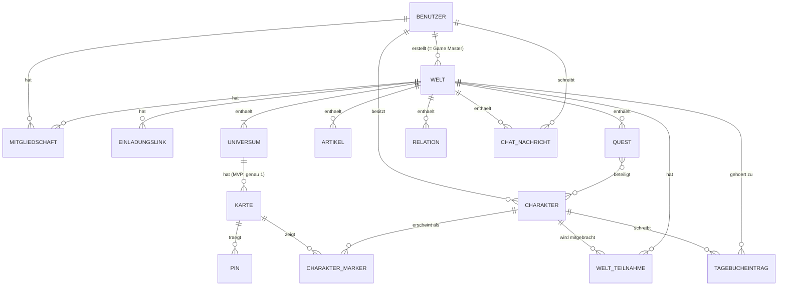

# Fachliches Datenmodell (MVP)

**Status:** Freigegeben durch den Projektinhaber am 2026-09-22. Alle offenen Fragen (Abschnitt 7) sind geklärt. Änderungen nur nach erneuter Abstimmung mit dem Projektinhaber.
**Bezug:** Plan `001-mvp-infrastruktur.md` (F1–F10, Rechtematrix). Grundlage für T-006, das dieses Modell in ein technisches Schema übersetzt.

Dieses Dokument beschreibt, **welche Dinge es gibt, welche Eigenschaften sie haben, wie sie zusammenhängen und welche Regeln gelten**, unabhängig von Datenbank und Backend. Datentypen sind fachlich gemeint (z. B. „Text, max. 120 Zeichen“), nicht technisch.

---

## 1. Überblick

Relationen verbinden Artikel, Quests, Charaktere und Pins beliebig miteinander (Inhaltsverweis, siehe 2.1). Sie sind im Diagramm nur als Zugehörigkeit zur Welt dargestellt.

**Leseregel:** Alles außer Benutzer und Charakter gehört (direkt oder indirekt) zu genau einer Welt. Wird eine Welt gelöscht, verschwindet alles, was zu ihr gehört. Charaktere gehören dem Benutzer und überleben das Löschen einer Welt.

---

## 2. Querschnittliche Konzepte

### 2.1 Inhaltsverweis

Mehrere Stellen verweisen auf „einen Inhalt der Welt“ (Pins, Relationen, Erwähnungen). Ein **Inhaltsverweis** besteht aus:

| Feld | Werte |
|---|---|
| Art | `artikel`, `quest`, `charakter`, `pin` |
| Ziel | der konkrete Artikel, die Quest, der Charakter oder der Pin |

Regeln:
- Das Ziel muss zur selben Welt gehören (bei Charakteren: in diese Welt mitgebracht sein).
- Pins können Quelle einer Relation sein (über Erwähnungen in ihrer Beschreibung) und Ende einer manuellen Relation. Über `@` erwähnbar sind sie **nicht** (siehe 2.4).

### 2.2 Sichtbarkeitsstatus

| Wert | Bedeutung |
|---|---|
| `veröffentlicht` | Alle Mitglieder der Welt sehen den Inhalt. |
| `nur Spielleitung` | Nur Game Master und Master sehen den Inhalt. |

Gilt für **Artikel, Quests, Pins, Universen und Karten** (OF-02).

Regeln:
- **Standardwert für neu angelegte Inhalte ist `nur Spielleitung`.** Die Spielleitung veröffentlicht bewusst.
- **Vererbung nach unten:** Ein Inhalt ist nur sichtbar, wenn auch alles darüber sichtbar ist. Ist ein Universum `nur Spielleitung`, sehen Player weder seine Karten noch deren Pins und Charakter-Marker, unabhängig von deren eigenem Status. Dasselbe gilt für eine versteckte Karte und ihre Pins.
- Das Veröffentlichen eines Universums veröffentlicht nicht automatisch seine Karten oder Pins. Jeder Inhalt behält seinen eigenen Status.

### 2.3 Rich-Text

Formatierter Text aus dem Artikel-Editor (TipTap) mit dem in Plan 001 festgelegten Funktionsumfang, inkl. Erwähnungen (`@Name`) als Inhaltsverweise. Wird zusätzlich als Klartext für die Suche vorgehalten. Rich-Text wird verwendet für: Welt- und Universumsbeschreibung, Artikelinhalt, Questbeschreibung, Pinbeschreibung, Charakter-Bio und Tagebucheinträge.

### 2.4 Erwähnung & Erwähnungssuche

Eine **Erwähnung** ist ein Inhaltsverweis mitten im Rich-Text, z. B.:

> Hier findet man den **@Gottschleim**. Du musst einen für die Quest **@Töte den Gottschleim** erlegen.

**Erwähnungssuche** (beim Tippen von `@` im Editor):
- Durchsucht die Titel bzw. Namen aller **Artikel, Quests und Charaktere** der Welt, die der schreibende Benutzer sehen darf.
- Treffer bei **Teilwort, ohne Beachtung der Groß-/Kleinschreibung**: `@Schleim` findet „Gottschleim“ (Artikel) und „Töte den Gottschleim“ (Quest).
- Jeder Vorschlag zeigt die **Kategorie** (`Artikel`, `Quest`, `Charakter`), bei Artikeln zusätzlich den Vorlagentyp (z. B. „Artikel · Ort“).
- Höchstens 10 Vorschläge, sortiert: Treffer am Wortanfang vor Treffern mitten im Wort, danach alphabetisch.

**Anzeige:** Eine Erwähnung erscheint als Link mit dem **aktuellen** Titel des Ziels (ein Umbenennen des Ziels aktualisiert alle Erwähnungen). Darf der Leser das Ziel nicht sehen oder existiert es nicht mehr, erscheint der zuletzt bekannte Titel als normaler Text ohne Link.

### 2.5 Verknüpfte Elemente

Jeder Artikel, jede Quest, jeder Charakter und jeder Pin zeigt einen Bereich **„Verknüpft“** mit allen Relationen, ein- und ausgehend, die der Betrachter sehen darf. Gruppiert nach Kategorie:

| Gruppe | Anzeige | Klick führt zu |
|---|---|---|
| Pins | Pin-Typ-Icon, Titel, Name der Karte | der Karte, zentriert und gezoomt auf die Koordinaten des Pins; der Pin ist hervorgehoben |
| Artikel | Titel, untergruppiert nach Vorlagentyp (z. B. „Orte“, „Personen“) | dem Artikel |
| Quests | Titel, Status | der Quest |
| Charaktere | Porträt, Name | dem Charakter |

Bei manuellen Relationen wird zusätzlich deren Bezeichnung angezeigt (siehe 3.14).

### 2.6 Protokollfelder

Alle von Benutzern bearbeitbaren Inhalte tragen: **erstellt am**, **erstellt von** (Benutzer), **geändert am**, **geändert von** (Benutzer). Sie sind in den Tabellen unten nicht jedes Mal wiederholt.

### 2.7 Relative Position

Positionen auf einer Karte werden als Paar (x, y) gespeichert, jeweils eine Dezimalzahl von 0 bis 1, relativ zu Breite und Höhe des Kartenbilds (0/0 = oben links). Damit bleiben Positionen gültig, unabhängig von Zoomstufe, Bildschirmgröße und Auflösung des Kartenbilds.

**Genauigkeit:** mindestens 6 Nachkommastellen. Das ergibt Pixelgenauigkeit bis zu einer Bildkantenlänge von 1.000.000 px und erlaubt pixelgenaues Verschieben auch bei stark vergrößerter Ansicht. Eine gröbere Speicherung (z. B. 3 Nachkommastellen) ist ausgeschlossen: Bei einem 8000 px breiten Bild entspräche sie Sprüngen von 8 px.

---

## 3. Entitäten

### 3.1 Benutzer

Wird beim ersten Discord-Login angelegt.

| Eigenschaft | Typ | Pflicht | Regel |
|---|---|:-:|---|
| Discord-ID | Text | ✅ | eindeutig |
| Anzeigename | Text, max. 100 | ✅ | bei jedem Login aus Discord aktualisiert |
| Avatar | URL | – | bei jedem Login aus Discord aktualisiert |
| E-Mail | E-Mail | – | nur falls Scope `email` genutzt wird |
| Registriert am | Zeitpunkt | ✅ | |
| Letzter Login | Zeitpunkt | ✅ | |

### 3.2 Welt

| Eigenschaft | Typ | Pflicht | Regel |
|---|---|:-:|---|
| Name | Text, max. 120 | ✅ | |
| Beschreibung | Rich-Text | – | |
| Titelbild | Bild (JPG/PNG/WebP, max. 10 MB) | – | |
| Ersteller | Benutzer | ✅ | unveränderlich; ist der Game Master |

Regeln:
- Beim Erstellen entstehen automatisch: eine Mitgliedschaft des Erstellers mit Rolle `Game Master` und ein erstes Universum (Name „Hauptuniversum“, umbenennbar).
- Eine Welt hat immer mindestens ein Universum.

### 3.3 Mitgliedschaft

Verbindet Benutzer und Welt.

| Eigenschaft | Typ | Pflicht | Regel |
|---|---|:-:|---|
| Welt | Welt | ✅ | |
| Benutzer | Benutzer | ✅ | pro Welt höchstens eine Mitgliedschaft |
| Rolle | `Game Master` / `Master` / `Player` | ✅ | |
| Beigetreten am | Zeitpunkt | ✅ | |
| Beigetreten über | Einladungslink | – | leer beim Ersteller |

Regeln:
- `Game Master` hat genau der Ersteller der Welt, niemand sonst. Seine Mitgliedschaft kann weder geändert noch entfernt werden.
- Neue Mitglieder erhalten immer `Player`.

### 3.4 Einladungslink

| Eigenschaft | Typ | Pflicht | Regel |
|---|---|:-:|---|
| Welt | Welt | ✅ | |
| Code | geheimer Zufallswert | ✅ | eindeutig, nicht erratbar |
| Widerrufen am | Zeitpunkt | – | gesetzt = ungültig |
| Gültigkeit | `1 Tag` / `7 Tage` / `unbegrenzt` | ✅ | beim Erstellen gewählt (OF-01) |
| Gültig bis | Zeitpunkt | – | aus der Gültigkeit berechnet; leer bei `unbegrenzt` |
| Bisherige Nutzungen | Zahl | ✅ | nur zur Anzeige |

Regeln:
- Nur der Game Master erstellt und widerruft Einladungslinks.
- Eine Welt kann mehrere gleichzeitig gültige Links haben. Die Anzahl der Nutzungen ist nicht begrenzt.
- Ein Link ist gültig, solange er nicht widerrufen und nicht abgelaufen ist.
- Öffnet ein angemeldeter Benutzer einen gültigen Link und ist noch kein Mitglied, wird er Player. Ist er bereits Mitglied, passiert nichts.

### 3.5 Universum

| Eigenschaft | Typ | Pflicht | Regel |
|---|---|:-:|---|
| Welt | Welt | ✅ | |
| Name | Text, max. 120 | ✅ | eindeutig innerhalb der Welt |
| Beschreibung | Rich-Text | – | |
| Reihenfolge | Zahl | ✅ | für die Anzeige, per Drag & Drop änderbar |
| Sichtbarkeit | Sichtbarkeitsstatus | ✅ | Standard `nur Spielleitung`; Ausnahme: das automatisch angelegte erste Universum ist `veröffentlicht` |

### 3.6 Karte

| Eigenschaft | Typ | Pflicht | Regel |
|---|---|:-:|---|
| Universum | Universum | ✅ | |
| Name | Text, max. 120 | ✅ | |
| Kartenbild | Bild (JPG/PNG/WebP, max. 20 MB) | ✅ | |
| Bildbreite, Bildhöhe | Zahl (px) | ✅ | beim Hochladen ermittelt |
| Sichtbarkeit | Sichtbarkeitsstatus | ✅ | Standard `nur Spielleitung` |

Regeln:
- **MVP:** höchstens eine Karte pro Universum (in der Anwendungslogik geprüft; das Modell erlaubt mehrere).
- Wird das Kartenbild ersetzt, bleiben Pins und Marker an ihrer relativen Position.

### 3.7 Pin

| Eigenschaft | Typ | Pflicht | Regel |
|---|---|:-:|---|
| Karte | Karte | ✅ | |
| Pin-Typ | einer der 12 Pin-Typen | ✅ | |
| Titel | Klartext, max. 120 | ✅ | enthält keine Erwähnungen |
| Beschreibung | Rich-Text | – | darf leer sein; im Popup angezeigt; **einziger Ort** für Erwähnungen am Pin, die ihn mit beliebig vielen Artikeln, Quests und Charakteren verknüpfen (OF-09) |
| Position | relative Position | ✅ | |
| Sichtbarkeit | Sichtbarkeitsstatus | ✅ | Standard `nur Spielleitung` |

### 3.8 Charakter

Gehört einem Benutzer, unabhängig von Welten.

| Eigenschaft | Typ | Pflicht | Regel |
|---|---|:-:|---|
| Besitzer | Benutzer | ✅ | unveränderlich |
| Name | Text, max. 120 | ✅ | |
| Profilbild | Bild (JPG/PNG/WebP, max. 10 MB) | – | wird auch als Charakter-Marker verwendet; ohne Bild: Platzhalter mit Initialen |
| Klasse | Text, max. 60 | – | Freitext (OF-07) |
| Attribute | je eine Ganzzahl 1–30 für Stärke, Geschicklichkeit, Konstitution, Intelligenz, Weisheit, Charisma | – | der Modifikator wird nur angezeigt, nicht gespeichert: abgerundet((Wert − 10) / 2) |
| Fertigkeiten | pro Fertigkeit: `ungeübt` / `geübt` / `Expertise` | – | feste Liste der 18 D&D-5e-Fertigkeiten, jeweils mit zugehörigem Attribut (z. B. Athletik → Stärke); Standard `ungeübt` |
| Persönlichkeitsmerkmale | Text, max. 1000 | – | |
| Ideale | Text, max. 1000 | – | |
| Bindungen | Text, max. 1000 | – | |
| Makel | Text, max. 1000 | – | |
| Bio | Rich-Text | – | Hintergrundgeschichte, Aussehen usw.; Erwähnungen erzeugen Relationen |
| Bildanhänge | Liste von Bildern (JPG/PNG/WebP, je max. 10 MB, höchstens 10) mit optionaler Bildunterschrift (Text, max. 200) | – | Reihenfolge änderbar |

Bewusst **nicht** enthalten (OF-08): Volk, Stufe, Trefferpunkte, Rüstungsklasse, Übungsbonus, Rettungswürfe, Inventar, Zauber.

Regel: Nur der Besitzer bearbeitet seinen Charakter. Mitglieder einer Welt sehen alle in diese Welt mitgebrachten Charaktere mit allen oben genannten Eigenschaften.

### 3.9 Welt-Teilnahme

Ein Charakter, der in eine Welt mitgebracht wurde.

| Eigenschaft | Typ | Pflicht | Regel |
|---|---|:-:|---|
| Charakter | Charakter | ✅ | |
| Welt | Welt | ✅ | pro Charakter und Welt höchstens eine Teilnahme |
| Aktiv | ja/nein | ✅ | |
| Mitgebracht am | Zeitpunkt | ✅ | |
| Archiviert am | Zeitpunkt | – | gesetzt = Teilnahme ruht (siehe Löschregeln, OF-05) |

Regeln:
- Der Besitzer des Charakters muss Mitglied der Welt sein, solange die Teilnahme nicht archiviert ist.
- Pro Benutzer und Welt ist höchstens **ein** Charakter aktiv. Wird ein anderer aktiv gesetzt, wird der bisherige automatisch inaktiv.
- Eine archivierte Teilnahme ist nie aktiv. Der Charakter und seine Tagebucheinträge dieser Welt sind dann für niemanden in der Welt sichtbar, auch nicht für die Spielleitung.
- Bringt der Besitzer denselben Charakter nach einem erneuten Beitritt wieder mit, wird die archivierte Teilnahme reaktiviert (Archiviert am wird geleert). Damit sind die früheren Tagebucheinträge wieder da.

### 3.10 Charakter-Marker

| Eigenschaft | Typ | Pflicht | Regel |
|---|---|:-:|---|
| Charakter | Charakter | ✅ | |
| Karte | Karte | ✅ | pro Charakter und Karte höchstens ein Marker |
| Position | relative Position | ✅ | |

Regeln (OF-04):
- Marker entstehen **nicht automatisch**. Der Besitzer platziert seinen aktiven Charakter bewusst auf einer Karte, oder die Spielleitung platziert ihn dort. Der Besitzer kann dafür nur Karten wählen, die er sehen darf.
- Ein Charakter kann auf mehreren Karten einen Marker haben, pro Karte höchstens einen.
- Besitzer und Spielleitung können einen Marker verschieben und von der Karte entfernen (= Marker löschen).
- Angezeigt werden nur Marker von Charakteren, die in der Welt der Karte **aktiv** sind. Wird ein Charakter inaktiv gesetzt, bleiben seine Marker gespeichert, werden aber ausgeblendet. Beim erneuten Aktivsetzen erscheinen sie wieder an derselben Stelle.

### 3.11 Artikel

| Eigenschaft | Typ | Pflicht | Regel |
|---|---|:-:|---|
| Welt | Welt | ✅ | |
| Titel | Text, max. 200 | ✅ | |
| Vorlagentyp | `ohne Vorlage` oder ein Vorlagentyp | ✅ | nach dem Anlegen änderbar; nicht passende Vorlagenfelder werden dabei verworfen (mit Warnung) |
| Vorlagenfelder | Werte je nach Vorlagentyp (siehe 3.12) | – | |
| Titelbild | Bild (JPG/PNG/WebP, max. 10 MB) | – | |
| Inhalt | Rich-Text | – | |
| Sichtbarkeit | Sichtbarkeitsstatus | ✅ | Standard `nur Spielleitung` |

### 3.12 Vorlagentyp (Konfiguration, keine Benutzerdaten)

Vorlagentypen werden im MVP **im Code definiert**, nicht von Benutzern angelegt. Jeder Vorlagentyp besteht aus einer Liste von Feldern:

| Eigenschaft eines Feldes | Werte |
|---|---|
| Schlüssel | technischer Name, z. B. `herrscher` |
| Bezeichnung | Anzeigename, z. B. „Herrscher“ |
| Feldart | `Text`, `Zahl`, `Auswahl` (feste Liste), `Verweis` (Inhaltsverweis, einer), `Verweisliste` (mehrere Inhaltsverweise) |
| Erlaubte Verweisziele | nur bei Verweis-Feldern, z. B. „nur Artikel vom Typ Person“ |

Konkrete Vorlagentypen und Felder legt der MVP-Funktionsplan fest. Das Modell muss neue Vorlagentypen ohne Schemaänderung aufnehmen können.

### 3.13 Quest

| Eigenschaft | Typ | Pflicht | Regel |
|---|---|:-:|---|
| Welt | Welt | ✅ | |
| Titel | Text, max. 200 | ✅ | |
| Beschreibung | Rich-Text | – | |
| Status | `offen` / `aktiv` / `abgeschlossen` / `gescheitert` | ✅ | Standard: `offen` |
| Beteiligte Charaktere | Liste von Charakteren | – | nur in diese Welt mitgebrachte Charaktere; pro Beteiligung wird zusätzlich der Charaktername als Text festgehalten (bleibt nach Löschen des Charakters sichtbar, OF-05) |
| Sichtbarkeit | Sichtbarkeitsstatus | ✅ | Standard `nur Spielleitung` |

Anmerkung: Ein eigenes Feld „Auftraggeber“ gibt es nicht. Auftraggeber, Orte und weitere Bezüge entstehen über Erwähnungen in der Beschreibung oder über manuelle Relationen (OF-10).

### 3.14 Relation

Gerichtete Verbindung zwischen zwei Inhalten. Es gibt zwei Sorten (OF-06):
- **Automatische Relationen** werden aus den Inhalten abgeleitet und nie direkt bearbeitet.
- **Manuelle Relationen** legt die Spielleitung direkt an, mit einer eigenen Bezeichnung (z. B. „ist verfeindet mit“, „ist Auftraggeber von“).

| Eigenschaft | Typ | Pflicht | Regel |
|---|---|:-:|---|
| Welt | Welt | ✅ | |
| Quelle | Inhaltsverweis | ✅ | |
| Ziel | Inhaltsverweis | ✅ | Quelle ≠ Ziel |
| Herkunft | siehe unten | ✅ | |
| Feld | Schlüssel des Vorlagenfelds | – | nur bei Herkunft `Vorlagenfeld` |
| Bezeichnung | Text, max. 60 | – | Pflicht bei Herkunft `manuell`, sonst leer |
| Gegenbezeichnung | Text, max. 60 | – | nur bei `manuell`: Anzeige aus Sicht des Ziels (z. B. „ist Auftraggeber von“ ↔ „hat Auftraggeber“); leer = dieselbe Bezeichnung in beide Richtungen |

**Herkunft** und woraus sie entsteht:

| Herkunft | Entsteht aus |
|---|---|
| `Erwähnung` | `@Name` im Rich-Text eines Artikels, einer Quest, eines Pins oder eines Charakters (nicht aus Tagebucheinträgen, siehe 3.15) |
| `Vorlagenfeld` | Verweis- oder Verweislisten-Feld eines Artikels |
| `Beteiligung` | beteiligter Charakter einer Quest (Quelle = Quest) |
| `manuell` | direkt von der Spielleitung angelegt |

Regeln:
- Beim Speichern eines Inhalts werden seine ausgehenden **automatischen** Relationen vollständig neu berechnet. Manuelle Relationen bleiben davon unberührt.
- Dieselbe Kombination aus Quelle, Ziel, Herkunft und Feld bzw. Bezeichnung existiert höchstens einmal.
- Manuelle Relationen legt nur die Spielleitung an, bearbeitet und löscht sie.
- Relationen erben die Sichtbarkeit: Eine Relation ist für einen Benutzer nur sichtbar, wenn er **Quelle und Ziel** sehen darf.
- Beim Anlegen einer manuellen Relation werden bereits verwendete Bezeichnungen der Welt als Vorschläge angeboten, damit gleiche Beziehungen gleich heißen.

### 3.15 Tagebucheintrag

| Eigenschaft | Typ | Pflicht | Regel |
|---|---|:-:|---|
| Charakter | Charakter | ✅ | |
| Welt | Welt | ✅ | der Charakter muss in diese Welt mitgebracht sein |
| Titel | Text, max. 200 | – | |
| Inhalt | Rich-Text | ✅ | Erwähnungen erzeugen **keine** Relationen (Geheimnisse sollen nicht über Relationen sichtbar werden) |
| Sichtbarkeit | `privat` / `mit Spielleitung geteilt` | ✅ | Standard: `privat` |

Regel: Nur der Besitzer des Charakters schreibt, bearbeitet und löscht Einträge.

### 3.16 Chat-Nachricht

| Eigenschaft | Typ | Pflicht | Regel |
|---|---|:-:|---|
| Welt | Welt | ✅ | |
| Autor | Benutzer | ✅ | |
| Text | Klartext, max. 2000 | ✅ | |
| Würfelwurf | Ausdruck, Einzelwerte je Würfel, Summe | – | nur vom Server gesetzt |
| Gesendet am | Zeitpunkt | ✅ | |

Regeln (OF-03):
- Nachrichten erscheinen immer unter dem **Benutzer** (Anzeigename und Avatar), nicht unter einem Charakter.
- Nachrichten können nicht bearbeitet werden.
- Der Autor kann eigene Nachrichten löschen, die Spielleitung alle. **Ausnahme:** Nachrichten mit Würfelwurf kann niemand löschen.
- Gelöschte Nachrichten werden endgültig entfernt (kein Platzhalter).

---

## 4. Löschregeln

| Wenn gelöscht wird … | … passiert mit abhängigen Daten |
|---|---|
| **Welt** | Alles, was zur Welt gehört, wird gelöscht (Mitgliedschaften, Einladungslinks, Universen, Karten, Pins, Marker, Artikel, Quests, Relationen, Welt-Teilnahmen, Tagebucheinträge dieser Welt, Chat). Charaktere bleiben beim Besitzer erhalten. |
| **Universum** | Seine Karten samt Pins und Markern werden gelöscht. Das letzte Universum einer Welt kann nicht gelöscht werden. |
| **Karte** | Pins und Marker der Karte werden gelöscht. |
| **Artikel**, **Quest** | Alle Relationen (automatisch und manuell) mit dem Inhalt als Quelle oder Ziel werden gelöscht. Erwähnungen in anderen Texten werden als nicht verlinkter Text angezeigt. |
| **Pin** | Alle Relationen mit dem Pin als Quelle oder Ziel werden gelöscht. |
| **Mitgliedschaft** (Benutzer verlässt die Welt oder wird entfernt) | Die Mitgliedschaft wird gelöscht. Seine Welt-Teilnahmen in dieser Welt werden **archiviert**, seine Charakter-Marker in dieser Welt gelöscht. Seine Tagebucheinträge bleiben erhalten, sind aber verborgen (siehe 3.9). Quest-Beteiligungen seiner Charaktere und seine Chat-Nachrichten bleiben unverändert. Von ihm erstellte Artikel, Quests usw. bleiben erhalten. Bei erneutem Beitritt kann er die Charaktere wieder mitbringen (OF-05). |
| **Charakter** (durch den Besitzer) | Alle Welt-Teilnahmen, Marker und Tagebucheinträge des Charakters werden gelöscht, ebenso Relationen mit dem Charakter als Quelle oder Ziel. Quest-Beteiligungen bleiben mit dem festgehaltenen Namen als Text (ohne Verlinkung). Erwähnungen werden als nicht verlinkter Text angezeigt (OF-05). |
| **Benutzerkonto** | Nicht Teil des MVP (Löschung nur manuell durch den Betreiber). |

---

## 5. Rechte je Entität

Umsetzung der Rechtematrix aus Plan 001. „Spielleitung“ = Game Master + Master.

| Entität | Ansehen | Erstellen / Bearbeiten / Löschen |
|---|---|---|
| Welt | Mitglieder | Bearbeiten: Spielleitung. Löschen: nur Game Master |
| Mitgliedschaft | Mitglieder | Rolle ändern (Player ↔ Master), entfernen: Spielleitung; nie beim Game Master |
| Einladungslink | Game Master | nur Game Master |
| Universum, Karte, Pin | `veröffentlicht` (inkl. aller übergeordneten Ebenen): Mitglieder; sonst: Spielleitung | Spielleitung |
| Charakter | Besitzer; Mitglieder jeder Welt mit nicht archivierter Teilnahme | nur Besitzer |
| Welt-Teilnahme | Mitglieder (nicht archivierte) | mitbringen, aktiv/inaktiv setzen: nur Besitzer des Charakters |
| Charakter-Marker | Mitglieder, sofern Charakter aktiv und Karte für sie sichtbar | platzieren, verschieben, entfernen: Besitzer des Charakters und Spielleitung |
| Artikel, Quest | `veröffentlicht`: Mitglieder; `nur Spielleitung`: Spielleitung | Spielleitung |
| Relation | wer Quelle **und** Ziel sehen darf | automatische: nie direkt; manuelle: Spielleitung |
| Tagebucheintrag | `privat`: Besitzer; `geteilt`: Besitzer + Spielleitung der Welt | nur Besitzer |
| Chat-Nachricht | Mitglieder | Schreiben: Mitglieder; Bearbeiten: niemand; Löschen: Autor (eigene) und Spielleitung (alle), außer Würfelwürfe |

---

## 6. Bewusst nicht im MVP-Modell

- Versionsverlauf von Artikeln (nur „geändert am/von“)
- Eigene, von Benutzern definierte Vorlagentypen
- Private Chat-Nachrichten, Chat-Kanäle
- Zuordnung von Artikeln oder Quests zu einem Universum
- Löschen von Benutzerkonten durch den Benutzer

---

## 7. Offene Fragen

| ID | Frage | Betrifft | Status |
|---|---|---|---|
| OF-01 | Laufen Einladungslinks ab, und/oder sind sie in der Anzahl der Nutzungen begrenzt? | 3.4 | ✅ Ablauf wählbar (1 Tag / 7 Tage / unbegrenzt), Nutzungen unbegrenzt |
| OF-02 | Gibt es den Status `nur Spielleitung` auch für Quests, Pins, Universen/Karten (z. B. versteckter Dungeon)? Welcher Standardwert gilt für neue Artikel? | 2.2, 3.7, 3.11, 3.13 | ✅ Artikel, Quests, Pins, Universen, Karten; Standard `nur Spielleitung`; Vererbung nach unten |
| OF-03 | Chat: Dürfen Nachrichten bearbeitet/gelöscht werden (von wem)? Schreibt man als Benutzer oder als aktiver Charakter? | 3.16 | ✅ als Benutzer; kein Bearbeiten; Löschen eigener bzw. durch Spielleitung, Würfe nie |
| OF-04 | Charakter-Marker: Entsteht er automatisch beim Aktivsetzen (wo?) oder setzt ihn jemand bewusst auf die Karte? Was passiert beim Deaktivieren? | 3.10 | ✅ Platzieren durch Besitzer oder Spielleitung; bei Deaktivierung ausgeblendet, nicht gelöscht |
| OF-05 | Was passiert mit Welt-Teilnahmen, Markern, Tagebucheinträgen und Quest-Beteiligungen, wenn ein Charakter gelöscht wird oder sein Besitzer die Welt verlässt? | 4 | ✅ Austritt archiviert; Löschen des Charakters löscht Tagebuch, Name bleibt in Quests |
| OF-06 | Reichen automatisch abgeleitete Relationen, oder braucht es manuelle Relationen mit eigener Bezeichnung (z. B. „ist verfeindet mit“)? Zählt ein Pin-Verweis als Relation? | 3.14 | ✅ automatisch + manuell mit Bezeichnung; Pins über ihre Beschreibung verknüpft |
| OF-07 | Sind Volk und Klasse Freitext oder Auswahl aus einer festen Liste (z. B. D&D-5e-Klassen)? | 3.8 | ✅ Klasse als Freitext; kein Volk |
| OF-08 | Brauchen Charaktere weitere Werte im MVP (z. B. Trefferpunkte, Rüstungsklasse, Gesinnung)? | 3.8 | ✅ Charakterbogen ohne Kampfwerte: Attribute, Fertigkeiten, Persönlichkeit, Bio, Bildanhänge |
| OF-09 | Darf ein Pin auf genau einen Inhalt verweisen (Vorschlag) oder auf mehrere? | 3.7 | ✅ beliebig viele, über Erwähnungen in der Pinbeschreibung |
| OF-10 | Quest-Auftraggeber: nur ein Artikel (z. B. Person) oder auch mehrere bzw. ein Charakter? Braucht eine Quest einen Ort-Verweis oder Unter-Quests? | 3.13 | ✅ keine festen Felder; Bezüge über Erwähnungen und manuelle Relationen; keine Unter-Quests |
