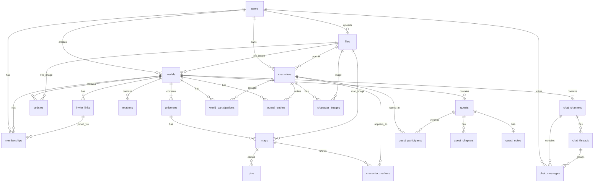

# Technisches Datenmodell (MVP)

**Status:** Freigegeben durch den Projektinhaber am 2026-09-22.
**Datum:** 2026-09-22
**Änderung 2026-09-23 (Plan `004`):** Enum `content_visibility` (`owner_only`, `gm_only`, `published`) für Artikel, Quests, Pins, Quest-Kapitel; `visibility_status` bleibt für Universen und Karten. Spalte `owner_id` an Artikeln, Quests, Pins, Kapiteln. Neue Tabellen `quest_chapters`, `quest_notes`. Regeln `APP-VIS-OWNER`, `APP-CHAPTER-REL`, `APP-NOTE-VERSION`, `APP-NOTE-NO-REL`.
**Bezug:** `.ai/architecture/datenmodell-fachlich.md` (freigegeben 2026-09-22, Plan `004` 2026-09-23), ADR-001 (PostgreSQL + Drizzle + Better Auth), ADR-003 (relative Position 0–1), ADR-004 (TipTap-JSON + Klartext)
**Nicht Ziel:** SQL-Migrationen oder Drizzle-Dateien — die entstehen im Grundgerüst (T-007) und in den Folgeplänen. Dieses Dokument ist die verbindliche Vorlage dafür.

**Leseregel:** Fachliche Namen bleiben Deutsch. Tabellen- und Spaltennamen sind Englisch/`snake_case` (Drizzle, Better Auth). Fachliche Enum-Werte werden intern als englische Schlüssel gespeichert; die Oberfläche zeigt die deutschen Bezeichnungen.

---

## 1. Überblick

Zwei Container: **App + PostgreSQL** (ADR-001). Dateien liegen auf einem Volume, Metadaten in `files`. Rechte sind **Anwendungslogik** (eine TypeScript-Schicht für HTTP, später SSE und MCP), nicht Row-Level-Security. PostgreSQL sichert Uniqueness, Archive-Regeln, Wertebereiche und das Aufräumen polymorpher Relationen.

Better Auth besitzt `users`, `sessions`, `accounts`, `verifications`. WorldCraft ergänzt `users` um `discord_id` und `last_login_at`. `users.email` ist `NOT NULL UNIQUE` (Better Auth). Discord-Login verlangt Scope `email` und schreibt die Adresse bei jedem Login fort; fehlt sie, wird das Login abgelehnt. Test-Benutzer (T-008, nur bei `ENABLE_TEST_LOGIN=true`) nutzen dieselbe Tabelle mit `discord_id`-Präfix `test-` und synthetischer E-Mail `test-…@localhost`.



Relationen verbinden Artikel, Quests, Charaktere, Pins und Universen polymorph (Abschnitt 7). Sie sind im Diagramm nur als Zugehörigkeit zur Welt dargestellt.

**Mehrere Karten pro Universum:** `maps.universe_id` hat **keinen** Unique-Constraint. Mehrere Karten sind Produktregel (Owner 2026-09-23; früher `APP-MAP-MVP-ONE` aufgehoben). `maps.image_id` ist optional (leere Karte).

---

## 2. Konventionen

| Thema | Festlegung |
|---|---|
| Primärschlüssel | `users.id` = `text` (Better Auth). Alle übrigen Tabellen: `uuid` mit `gen_random_uuid()`. |
| Zeit | `timestamptz`, Default `now()` |
| Protokollfelder (fachl. 2.6) | `created_at`, `created_by` → `users.id`, `updated_at`, `updated_by` → `users.id`. Pflicht auf allen vom Benutzer bearbeitbaren Inhalten. Chat-Nachrichten haben `sent_at` + `author_id` und bei Bearbeitung `edited_at` (Plan `007`, 2026-09-23) — kein vollständiges `updated_*`-Paar. Kanäle und Threads haben Protokollfelder. |
| Rich-Text (fachl. 2.3, ADR-004) | `*_json jsonb` (TipTap-Dokument) plus `*_plain text` (abgeleiteter Klartext für Suche). Beide zusammen oder beide leer. |
| Relative Position (fachl. 2.7) | `pos_x`, `pos_y` als `numeric(8,7)` mit `CHECK (… >= 0 AND … <= 1)`. Sieben Nachkommastellen, fachlich mindestens sechs. |
| Dateien | Zeile in `files` plus Objekt auf Volume. MIME und Größe in der Anwendung, nicht nur in der DB. |
| Soft-Archive | `archived_at timestamptz NULL`. `NULL` = aktiv. Gesetzt = ruht, gilt in allen Rechteprüfungen als nicht vorhanden. |
| Enums | PostgreSQL-`ENUM`. Stabile, kleine Wertemengen. Neue Werte nur per Migration. |

### 2.1 Enum-Werte

| Typ | Schlüssel (DB) | Fachlich |
|---|---|---|
| `visibility_status` | `published`, `gm_only` | veröffentlicht, nur Spielleitung — **nur** Universen und Karten (Karten-Ausnahme) |
| `content_visibility` | `owner_only`, `gm_only`, `published` | nur ich, nur Spielleitung, veröffentlicht — Artikel, Quests, Quest-Kapitel, Pins |
| `membership_role` | `game_master`, `master`, `player` | Game Master, Master, Player |
| `invite_validity` | `one_day`, `seven_days`, `unlimited` | 1 Tag, 7 Tage, unbegrenzt |
| `pin_type` | `danger`, `boss`, `house`, `city`, `treasure`, `landmark`, `fishing`, `plants`, `dungeon`, `quest`, `teleporter`, `shop` | Gefahr, Boss, Haus, Stadt, Schatz, Stern, Angeln, Pflanzen, Dungeon, Quest, Teleporter, Shop |
| `quest_status` | `open`, `active`, `completed`, `failed` | offen, aktiv, abgeschlossen, gescheitert |
| `skill_level` | `untalented`, `untrained`, `trained`, `expertise` | untalentiert, ungeübt, geübt, Expertise |
| `journal_visibility` | `private`, `shared_with_gm` | privat, mit Spielleitung geteilt |
| `content_kind` | `article`, `quest`, `character`, `pin`, `universe` | artikel, quest, charakter, pin, universum |
| `relation_origin` | `mention`, `template_field`, `participation`, `manual` | Erwähnung, Vorlagenfeld, Beteiligung, manuell |

### 2.2 Dateien (`files`)

Technische Hilfstabelle. Keine fachliche Entität. Jede Bild-Eigenschaft zeigt hierher.

| Spalte | Typ | Pflicht | Regel |
|---|---|:-:|---|
| `id` | uuid PK | ✅ | |
| `storage_key` | text | ✅ | eindeutig, Pfad relativ zum Volume |
| `mime` | text | ✅ | nur `image/jpeg`, `image/png`, `image/webp` (`APP-FILE-MIME`) |
| `byte_size` | integer | ✅ | `CHECK (byte_size > 0)` |
| `width_px` | integer | – | beim Kartenbild Pflicht (`APP-MAP-DIMS`) |
| `height_px` | integer | – | beim Kartenbild Pflicht |
| `created_by` | text FK `users` | ✅ | |
| `created_at` | timestamptz | ✅ | |

Größenlimits in der Anwendung, nicht als eine globale CHECK-Klausel (Karten 20 MB, alle anderen Bilder 10 MB): `APP-FILE-SIZE`.

---

## 3. Tabellen

`sessions`, `accounts`, `verifications` bleiben das Better-Auth-Standard-Schema (siehe [Better Auth Database](https://www.better-auth.com/docs/concepts/database)). Sie werden hier nicht nachgebaut.

### 3.1 `users` (Benutzer)

| Spalte | Typ | Pflicht | Regel |
|---|---|:-:|---|
| `id` | text PK | ✅ | Better Auth |
| `name` | text | ✅ | Anzeigename, max. 100 (`CHECK (char_length(name) BETWEEN 1 AND 100)`), bei jedem Login aus Discord aktualisiert (`APP-USER-SYNC`) |
| `email` | text | ✅ | `NOT NULL UNIQUE`. Discord: bei jedem Login aus dem Profil übernommen (`APP-USER-SYNC`). Liefert Discord keine Adresse, wird das Login abgelehnt (`APP-LOGIN-REQUIRE-EMAIL`) — kein Platzhalter für echte Discord-Benutzer. Test-Login: feste synthetische Adressen (Abschnitt 3.1.1). Siehe Abschnitt 13 A. |
| `email_verified` | boolean | ✅ | Better Auth, Default false |
| `image` | text | – | Avatar-URL von Discord, bei jedem Login aktualisiert (`APP-USER-SYNC`). Animierte Discord-Avatare (`cdn.discordapp.com`, Endung `.gif`) werden beim Sync und per Migration auf `.png` umgeschrieben (`APP-AVATAR-STATIC`, Plan `007`, 2026-09-23) — die UI zeigt nie animierte Profilbilder. |
| `discord_id` | text | ✅ | eindeutig. Echte Discord-Snowflake oder `test-…` (T-008) |
| `last_login_at` | timestamptz | ✅ | |
| `created_at` | timestamptz | ✅ | = Registriert am |
| `updated_at` | timestamptz | ✅ | Better Auth |

Discord-OAuth nutzt die Scopes `identify` **und** `email` (Pflicht). Plan `001` nennt `email` noch optional — das ist eine dokumentierte Abweichung, Plan `001` wird hier nicht stillschweigend geändert.

#### 3.1.1 Test-Login-Benutzer

Nur vorhanden, wenn `ENABLE_TEST_LOGIN=true` (Staging und lokal, nie Produktion). Kein Discord-Konto; `discord_id` mit Präfix `test-`. E-Mail ist trotzdem Pflicht:

| `discord_id` | E-Mail |
|---|---|
| `test-gm` | `test-gm@localhost` |
| `test-master` | `test-master@localhost` |
| `test-player-a` | `test-player-a@localhost` |
| `test-player-b` | `test-player-b@localhost` |

### 3.2 `worlds` (Welt)

| Spalte | Typ | Pflicht | Regel |
|---|---|:-:|---|
| `id` | uuid PK | ✅ | |
| `name` | text | ✅ | max. 120 |
| `description_json` | jsonb | – | Rich-Text **ohne** Erwähnungs-Nodes (`APP-WORLD-NO-MENTIONS`) |
| `description_plain` | text | – | |
| `title_image_id` | uuid FK `files` ON DELETE SET NULL | – | max. 10 MB (`APP-FILE-SIZE`) |
| `created_by` | text FK `users` | ✅ | Ersteller = Game Master; **unveränderlich** (`TRIG-WORLD-CREATOR-IMMUTABLE`) |
| `created_at` | timestamptz | ✅ | |
| `updated_at` | timestamptz | ✅ | |
| `updated_by` | text FK `users` | ✅ | |

Protokoll: `created_by` ist zugleich Ersteller. Kein zweites Ersteller-Feld.

### 3.3 `memberships` (Mitgliedschaft)

| Spalte | Typ | Pflicht | Regel |
|---|---|:-:|---|
| `id` | uuid PK | ✅ | |
| `world_id` | uuid FK `worlds` ON DELETE CASCADE | ✅ | |
| `user_id` | text FK `users` | ✅ | |
| `role` | `membership_role` | ✅ | |
| `joined_at` | timestamptz | ✅ | |
| `joined_via_invite_id` | uuid FK `invite_links` ON DELETE SET NULL | – | leer beim Ersteller |
| `archived_at` | timestamptz | – | gesetzt = ruht |
| `created_at` | timestamptz | ✅ | |
| `created_by` | text FK `users` | ✅ | |
| `updated_at` | timestamptz | ✅ | |
| `updated_by` | text FK `users` | ✅ | |

Constraints:
- `UNIQUE (world_id, user_id)` — höchstens eine Mitgliedschaft inkl. Archiv (`UQ-MEMBERSHIP`)
- Partieller Unique-Index `UNIQUE (world_id) WHERE role = 'game_master' AND archived_at IS NULL` (`UQ-ONE-GM`)
- `TRIG-GM-IS-CREATOR`: Zeile mit `role = game_master` muss `user_id = worlds.created_by` haben; diese Zeile darf nicht archiviert, in der Rolle geändert oder gelöscht werden

### 3.4 `invite_links` (Einladungslink)

| Spalte | Typ | Pflicht | Regel |
|---|---|:-:|---|
| `id` | uuid PK | ✅ | |
| `world_id` | uuid FK `worlds` ON DELETE CASCADE | ✅ | |
| `code` | text | ✅ | eindeutig, 32 Byte hex / url-safe (`APP-INVITE-ENTROPY`) |
| `validity` | `invite_validity` | ✅ | |
| `expires_at` | timestamptz | – | berechnet; leer bei `unlimited` |
| `revoked_at` | timestamptz | – | gesetzt = ungültig |
| `use_count` | integer | ✅ | Default 0, `CHECK (>= 0)`, nur Anzeige |
| `created_at` | timestamptz | ✅ | |
| `created_by` | text FK `users` | ✅ | |
| `updated_at` | timestamptz | ✅ | |
| `updated_by` | text FK `users` | ✅ | |

Gültigkeit (`APP-INVITE-VALID`): `revoked_at IS NULL` und (`expires_at IS NULL` oder `expires_at > now()`). Anzahl gleichzeitiger gültiger Links unbegrenzt.

### 3.5 `universes` (Universum)

| Spalte | Typ | Pflicht | Regel |
|---|---|:-:|---|
| `id` | uuid PK | ✅ | |
| `world_id` | uuid FK `worlds` ON DELETE CASCADE | ✅ | |
| `name` | text | ✅ | max. 120; `UNIQUE (world_id, name)` (`UQ-UNIVERSE-NAME`) |
| `description_json` | jsonb | – | Rich-Text mit Erwähnungen |
| `description_plain` | text | – | |
| `sort_order` | integer | ✅ | Anzeigereihenfolge |
| `visibility` | `visibility_status` | ✅ | Default `gm_only` |
| Protokollfelder | | ✅ | |

### 3.6 `maps` (Karte)

| Spalte | Typ | Pflicht | Regel |
|---|---|:-:|---|
| `id` | uuid PK | ✅ | |
| `universe_id` | uuid FK `universes` ON DELETE CASCADE | ✅ | **kein** Unique — mehrere Karten erlaubt |
| `name` | text | ✅ | max. 120 |
| `image_id` | uuid FK `files` | ✅ | max. 20 MB; Breite/Höhe in `files` |
| `visibility` | `visibility_status` | ✅ | Default `gm_only` |
| Protokollfelder | | ✅ | |

Bild ersetzen: `image_id` wechseln. Pins/Marker bleiben über relative `pos_x`/`pos_y` gültig (`APP-MAP-REPLACE`).

### 3.7 `pins` (Pin)

| Spalte | Typ | Pflicht | Regel |
|---|---|:-:|---|
| `id` | uuid PK | ✅ | |
| `map_id` | uuid FK `maps` ON DELETE CASCADE | ✅ | |
| `pin_type` | `pin_type` | ✅ | |
| `title` | text | ✅ | max. 120, Klartext, keine Mention-Nodes (`APP-PIN-TITLE-PLAIN`) |
| `description_json` | jsonb | – | darf leer sein; einziger Ort für Erwähnungen am Pin |
| `description_plain` | text | – | |
| `pos_x`, `pos_y` | numeric(8,7) | ✅ | 0–1 |
| `visibility` | `content_visibility` | ✅ | Default `owner_only` |
| `owner_id` | text FK `users` | ✅ | anlegender Benutzer; Löschverhalten wie `created_by`; Index über Karte nicht nötig (Pins immer über `map_id`) |
| `locked` | boolean | ✅ | Default `false`. Sperren/Entsperren nur Spielleitung (`requireStaff`). Ist `locked = true`, wird jede Änderung außer `locked → false` sowie das Löschen mit 409 abgelehnt (`APP-PIN-LOCK`) |
| Protokollfelder | | ✅ | |

### 3.8 `characters` (Charakter)

| Spalte | Typ | Pflicht | Regel |
|---|---|:-:|---|
| `id` | uuid PK | ✅ | |
| `owner_id` | text FK `users` | ✅ | unveränderlich (`TRIG-CHAR-OWNER-IMMUTABLE`) |
| `name` | text | ✅ | max. 120 |
| `portrait_id` | uuid FK `files` ON DELETE SET NULL | – | max. 10 MB; ohne Bild: Initialen in der UI |
| `class` | text | – | max. 60, Freitext |
| `attr_str` … `attr_cha` | smallint | – | je `CHECK (NULL OR BETWEEN 1 AND 30)`; Modifikator wird nicht gespeichert |
| `skills` | jsonb | ✅ | Array eigener Fertigkeiten, Default `[]`, max. 30 (Abschnitt 3.8.1) |
| `proficiency_bonus` | smallint | ✅ | Default 2, `CHECK (BETWEEN 0 AND 10)` |
| `abilities` | jsonb | ✅ | Array eigener Fähigkeiten, Default `[]`, max. 30 (Abschnitt 3.8.2) |
| `personality` | text | – | max. 1000 |
| `ideals` | text | – | max. 1000 |
| `bonds` | text | – | max. 1000 |
| `flaws` | text | – | max. 1000 |
| `bio_json` | jsonb | – | Rich-Text **ohne** Erwähnungen im MVP (`APP-BIO-NO-MENTIONS`, Projektinhaber 2026-09-23); keine Relationen aus der Bio |
| `bio_plain` | text | – | |
| Protokollfelder | | ✅ | |

#### 3.8.1 `skills`-JSONB

Geordnetes Array frei angelegter Fertigkeiten (Entscheidung Projektinhaber 2026-09-22, ersetzt die frühere feste Liste der 18 D&D-5e-Fertigkeiten). Die Reihenfolge im Array ist die Anzeigereihenfolge.

```json
[{ "name": "Schlösser knacken", "level": "expertise", "attr": "dex" }]
```

| Feld | Typ | Regel |
|---|---|---|
| `name` | string | Pflicht, getrimmt 1–60 Zeichen; pro Charakter eindeutig, Vergleich ohne Groß-/Kleinschreibung |
| `level` | `skill_level` | `untalented` \| `untrained` \| `trained` \| `expertise` |
| `attr` | string | `str` \| `dex` \| `con` \| `int` \| `wis` \| `cha` (skalierendes Attribut; die UI zeigt dessen Modifikator) |

Gesamtbonus (nur berechnet, nicht gespeichert) = abgerundet((Attributwert − 10) / 2) + Aufschlag: `untalented` −4 (fest), `untrained` −2 (fest), `trained` + `proficiency_bonus`, `expertise` + 2 × `proficiency_bonus`. Ist das Attribut leer, rechnet die UI mit Modifikator 0.

Höchstens 30 Einträge; neuer Charakter startet mit `[]`. Prüfung in der Anwendung per Zod (`APP-CHAR-SKILLS`); zusätzlich `CHECK (jsonb_typeof(skills) = 'array')`. Die bestehende Migration hat noch `= 'object'` und wird in Plan `003` T-008 umgestellt.

#### 3.8.2 `abilities`-JSONB

Geordnetes Array frei angelegter Fähigkeiten (Entscheidung Projektinhaber 2026-09-22). Die Reihenfolge im Array ist die Anzeigereihenfolge.

```json
[{ "text": "Zwei Pfeile gleichzeitig schießen", "attr": "dex" }]
```

| Feld | Typ | Regel |
|---|---|---|
| `text` | string | Pflicht, getrimmt 1–120 Zeichen; pro Charakter eindeutig, Vergleich ohne Groß-/Kleinschreibung |
| `attr` | string | `str` \| `dex` \| `con` \| `int` \| `wis` \| `cha` (skalierendes Attribut) |

Kein Übungsgrad und kein Übungsbonus. Angezeigt wird nur abgerundet((Attributwert − 10) / 2), nicht gespeichert; leeres Attribut → 0. Höchstens 30 Einträge; neuer Charakter startet mit `[]`. Prüfung per Zod (`APP-CHAR-ABILITIES`); zusätzlich `CHECK (jsonb_typeof(abilities) = 'array')`. Spalte entsteht in Plan `003` T-008.

### 3.9 `character_images` (Bildanhänge)

| Spalte | Typ | Pflicht | Regel |
|---|---|:-:|---|
| `id` | uuid PK | ✅ | |
| `character_id` | uuid FK `characters` ON DELETE CASCADE | ✅ | |
| `file_id` | uuid FK `files` | ✅ | max. 10 MB |
| `caption` | text | – | max. 200 |
| `sort_order` | integer | ✅ | |
| Protokollfelder | | ✅ | |

`UNIQUE (character_id, sort_order)`. Höchstens 10 Zeilen pro Charakter: `TRIG-CHAR-IMAGES-MAX` (BEFORE INSERT, `COUNT(*) < 10`).

### 3.10 `world_participations` (Welt-Teilnahme)

| Spalte | Typ | Pflicht | Regel |
|---|---|:-:|---|
| `id` | uuid PK | ✅ | |
| `character_id` | uuid FK `characters` ON DELETE CASCADE | ✅ | |
| `world_id` | uuid FK `worlds` ON DELETE CASCADE | ✅ | |
| `brought_at` | timestamptz | ✅ | |
| `archived_at` | timestamptz | – | gesetzt = ruht |
| Protokollfelder | | ✅ | |

`UNIQUE (character_id, world_id)` inkl. Archiv (`UQ-PARTICIPATION`). Reaktivieren = `archived_at` leeren (`APP-PART-REACTIVATE`).

`TRIG-PART-OWNER-MEMBER`: solange `archived_at IS NULL`, muss der Charakterbesitzer eine nicht archivierte Mitgliedschaft in derselben Welt haben.

### 3.11 `character_markers` (Charakter-Marker)

| Spalte | Typ | Pflicht | Regel |
|---|---|:-:|---|
| `id` | uuid PK | ✅ | |
| `character_id` | uuid FK `characters` ON DELETE CASCADE | ✅ | |
| `map_id` | uuid FK `maps` ON DELETE CASCADE | ✅ | |
| `pos_x`, `pos_y` | numeric(8,7) | ✅ | 0–1 |
| Protokollfelder | | ✅ | |

`UNIQUE (character_id)` (`UQ-MARKER-CHARACTER`, Owner 2026-09-23). Früher `UNIQUE (character_id, map_id)`. Entstehen nicht automatisch (`APP-MARKER-MANUAL`). Entfernen = Zeile löschen. Platzieren auf einer anderen Karte löscht den bisherigen Marker.

### 3.12 `articles` (Artikel)

| Spalte | Typ | Pflicht | Regel |
|---|---|:-:|---|
| `id` | uuid PK | ✅ | |
| `world_id` | uuid FK `worlds` ON DELETE CASCADE | ✅ | |
| `title` | text | ✅ | max. 200 |
| `template_type` | text | ✅ | `none` oder Schlüssel aus Code-Registry (`APP-TEMPLATE-REGISTRY`) |
| `template_fields` | jsonb | ✅ | Default `{}`; Form siehe Abschnitt 6 |
| `title_image_id` | uuid FK `files` ON DELETE SET NULL | – | max. 10 MB |
| `body_json` | jsonb | – | |
| `body_plain` | text | – | |
| `first_edited_at` | timestamptz | – | gesetzt = keine Stub-Darstellung mehr. Erstes Speichern mit nicht-leerem `body_plain` oder mindestens einem Vorlagenfeld setzt es (`APP-STUB-EDIT`). Umbenennen, Titelbild oder Sichtbarkeit allein setzen es nicht. Einmal gesetzt, bleibt es gesetzt. |
| `visibility` | `content_visibility` | ✅ | Default `owner_only` |
| `owner_id` | text FK `users` | ✅ | anlegender Benutzer; Löschverhalten wie `created_by` |
| Protokollfelder | | ✅ | |

Index: `(world_id, owner_id)`.

Vorlagentyp ändern: Anwendung verwirft nicht passende Schlüssel nach Warnung (`APP-TEMPLATE-SWITCH`).

### 3.13 `quests` (Quest)

| Spalte | Typ | Pflicht | Regel |
|---|---|:-:|---|
| `id` | uuid PK | ✅ | |
| `world_id` | uuid FK `worlds` ON DELETE CASCADE | ✅ | |
| `title` | text | ✅ | max. 200 |
| `description_json` | jsonb | – | |
| `description_plain` | text | – | |
| `status` | `quest_status` | ✅ | Default `open` |
| `visibility` | `content_visibility` | ✅ | Default `owner_only` |
| `owner_id` | text FK `users` | ✅ | anlegender Benutzer; Löschverhalten wie `created_by` |
| Protokollfelder | | ✅ | |

Index: `(world_id, owner_id)`.

### 3.13a `quest_chapters` (Quest-Kapitel)

| Spalte | Typ | Pflicht | Regel |
|---|---|:-:|---|
| `id` | uuid PK | ✅ | |
| `quest_id` | uuid FK `quests` ON DELETE CASCADE | ✅ | |
| `title` | text | ✅ | 1–200 Zeichen |
| `body_json` | jsonb | – | |
| `body_plain` | text | – | |
| `body_tsv` | tsvector generated | ✅ | wie bei `quests.description_tsv`, Konfiguration `german` |
| `position` | integer | ✅ | Anzeigereihenfolge |
| `visibility` | `content_visibility` | ✅ | Default `owner_only` |
| `owner_id` | text FK `users` | ✅ | anlegender Benutzer |
| Protokollfelder | | ✅ | |

Index: `(quest_id, position)`; GIN auf `body_tsv`.

### 3.13b `quest_notes` (Quest-Notizblock)

| Spalte | Typ | Pflicht | Regel |
|---|---|:-:|---|
| `quest_id` | uuid PK, FK `quests` ON DELETE CASCADE | ✅ | eine Zeile pro Quest; entsteht beim ersten Speichern |
| `body_json` | jsonb | – | |
| `body_plain` | text | – | |
| `version` | integer | ✅ | Default 0; bei erfolgreichem Speichern +1 (`APP-NOTE-VERSION`) |
| `updated_at` | timestamptz | ✅ | |
| `updated_by` | text FK `users` | ✅ | |

Keine Erwähnungs-Relationen (`APP-NOTE-NO-REL`). Nicht in der Hub-Suche.

### 3.14 `quest_participants` (Beteiligte)

| Spalte | Typ | Pflicht | Regel |
|---|---|:-:|---|
| `id` | uuid PK | ✅ | |
| `quest_id` | uuid FK `quests` ON DELETE CASCADE | ✅ | |
| `character_id` | uuid FK `characters` ON DELETE SET NULL | – | nach Charakterlöschung leer; Name bleibt |
| `character_name` | text | ✅ | Snapshot, max. 120 |
| Protokollfelder | | ✅ | |

`UNIQUE (quest_id, character_id) WHERE character_id IS NOT NULL`. Nur Charaktere mit (ggf. später archivierter) Teilnahme an der Quest-Welt (`APP-QUEST-PART`). Speichern der Quest erzeugt/aktualisiert Relationen `origin = participation` (`APP-REL-RECALC`).

### 3.15 `relations` (Relation)

| Spalte | Typ | Pflicht | Regel |
|---|---|:-:|---|
| `id` | uuid PK | ✅ | |
| `world_id` | uuid FK `worlds` ON DELETE CASCADE | ✅ | |
| `source_kind` | `content_kind` | ✅ | |
| `source_article_id` … `source_universe_id` | uuid FK, ON DELETE CASCADE | genau eine | siehe Abschnitt 7 |
| `source_id` | uuid generated | ✅ | `COALESCE` der fünf Source-FKs |
| `target_kind` | `content_kind` | ✅ | |
| `target_article_id` … `target_universe_id` | uuid FK, ON DELETE CASCADE | genau eine | |
| `target_id` | uuid generated | ✅ | analog |
| `origin` | `relation_origin` | ✅ | |
| `template_field_key` | text | – | Pflicht bei `template_field` |
| `label` | text | – | Pflicht bei `manual`, max. 60 |
| `counter_label` | text | – | nur `manual`, max. 60; leer = dieselbe Bezeichnung beide Richtungen |
| Protokollfelder | | ✅ | |

Checks (`CHK-REL-SHAPE`):
- genau eine Source-FK gesetzt, passend zu `source_kind`
- genau eine Target-FK gesetzt, passend zu `target_kind`
- Quelle ≠ Ziel: `NOT (source_kind = target_kind AND source_id = target_id)`
- `origin = mention | participation` → `template_field_key` und `label` leer
- `origin = template_field` → `template_field_key` gesetzt, `label` leer
- `origin = manual` → `label` gesetzt, `template_field_key` leer

Eindeutigkeit (`UQ-REL`):

```
UNIQUE (world_id, source_kind, source_id, target_kind, target_id, origin,
        COALESCE(template_field_key, ''), COALESCE(label, ''))
```

Gleiche Welt: `TRIG-REL-SAME-WORLD` (Artikel/Quest/Universum direkt; Pin über Karte→Universum; Charakter über `world_participations`, Archiv erlaubt).

### 3.16 `journal_entries` (Tagebucheintrag)

| Spalte | Typ | Pflicht | Regel |
|---|---|:-:|---|
| `id` | uuid PK | ✅ | |
| `character_id` | uuid FK `characters` ON DELETE CASCADE | ✅ | |
| `world_id` | uuid FK `worlds` ON DELETE CASCADE | ✅ | |
| `title` | text | – | max. 200 |
| `body_json` | jsonb | ✅ | Erwähnungen erzeugen **keine** Relationen (`APP-JOURNAL-NO-REL`) |
| `body_plain` | text | ✅ | |
| `visibility` | `journal_visibility` | ✅ | Default `private` |
| Protokollfelder | | ✅ | |

`TRIG-JOURNAL-PART`: es existiert eine `world_participations`-Zeile für dasselbe Paar (Charakter, Welt), archiviert oder nicht. Anzeige folgt der Teilnahme (archiviert = für niemanden in der Welt sichtbar).

### 3.17 Chat (Kanäle, Threads, Nachrichten)

Abweichung vom fachlichen Modell: eine Welt hat einen oder mehrere Kanäle, nicht eine einzelne Nachrichtenliste. Begründung, Datum und Verweis: Abschnitt 13 B. Beim Anlegen einer Welt entsteht der Kanal „Allgemein“ (`APP-WORLD-CREATE`).

#### `chat_channels` (Kanal)

| Spalte | Typ | Pflicht | Regel |
|---|---|:-:|---|
| `id` | uuid PK | ✅ | |
| `world_id` | uuid FK `worlds` ON DELETE CASCADE | ✅ | |
| `name` | text | ✅ | Pflicht, max. 80. Eindeutig unter den **aktiven** Kanälen der Welt |
| `sort_order` | integer | ✅ | Reihenfolge in der Kanalliste |
| `archived_at` | timestamptz | – | `NULL` = aktiv. Gesetzt = archiviert, für alle aus der Liste; Nachrichten und Würfe bleiben |
| Protokollfelder | | ✅ | |

`UQ-CHANNEL-NAME`: partieller Unique-Index auf `(world_id, name) WHERE archived_at IS NULL`. Der letzte aktive Kanal einer Welt kann nicht archiviert werden (`APP-CHANNEL-LAST`). Anlegen, umbenennen, Reihenfolge, Archivieren und Wiederherstellen: nur Spielleitung. Lesen und Schreiben: jedes aktive Mitglied.

#### `chat_threads` (Thread)

| Spalte | Typ | Pflicht | Regel |
|---|---|:-:|---|
| `id` | uuid PK | ✅ | |
| `channel_id` | uuid FK `chat_channels` ON DELETE CASCADE | ✅ | genau ein Kanal |
| `title` | text | ✅ | max. 80 (`THREAD_TITLE_MAX`); einzige Quelle für den Thread-Titel (Plan `007`, 2026-09-23) |
| `created_from_message_id` | uuid FK `chat_messages` | ✅ | Eröffnungsnachricht im Hauptstrom; dieselbe Transaktion (`APP-THREAD-OPEN`); Eröffnungsnachricht hat `body` leer, Titel nur hier |
| Protokollfelder | | ✅ | |

Threads werden im MVP nicht einzeln archiviert oder gelöscht. Umbenennen: Ersteller (`created_by`) oder Spielleitung (`APP-THREAD-RENAME`, Plan `007`, 2026-09-23). Archiviert der Kanal, verschwinden seine Threads mit ihm aus der Liste.

#### `chat_messages` (Chat-Nachricht)

| Spalte | Typ | Pflicht | Regel |
|---|---|:-:|---|
| `id` | uuid PK | ✅ | |
| `world_id` | uuid FK `worlds` ON DELETE CASCADE | ✅ | bleibt; dieselbe Welt wie der Kanal |
| `channel_id` | uuid FK `chat_channels` | ✅ | |
| `thread_id` | uuid FK `chat_threads` | – | leer = Hauptstrom des Kanals |
| `opens_thread_id` | uuid FK `chat_threads` | – | optional, eindeutig. Die Nachricht bleibt im Hauptstrom (`thread_id` leer) und eröffnet den Thread; `body` dann leer (C8) |
| `author_id` | text FK `users` | ✅ | Anzeige immer als Benutzer |
| `body` | text | – | Klartext, max. 2000; `NULL` genau dann, wenn `opens_thread_id` gesetzt (`CHK-OPENER-BODY`, Plan `007`, 2026-09-23) |
| `dice_expression` | text | – | nur Server (`APP-DICE-SERVER`) |
| `dice_terms` | jsonb | – | Würfe **pro Term**, z. B. `[{ "sides": 20, "sign": 1, "values": [15] }, { "modifier": -1 }]`. Ersetzt eine flache Werteliste |
| `dice_sum` | integer | – | |
| `sent_at` | timestamptz | ✅ | |
| `edited_at` | timestamptz | – | gesetzt = Nachricht wurde bearbeitet; Anzeige „(bearbeitet)“ (Plan `007`, 2026-09-23) |

Kein vollständiges `updated_*`-Paar — bei Bearbeitung nur `edited_at` (`APP-CHAT-EDIT`). `UQ-MSG-OPENS-THREAD`: `opens_thread_id` eindeutig, wo gesetzt (mehrere `NULL` bleiben erlaubt). `CHK-OPENER-BODY`: `body IS NULL` genau dann, wenn `opens_thread_id IS NOT NULL`. Würfelwurf = `dice_expression`, `dice_terms` und `dice_sum` gemeinsam gesetzt. `CHK-DICE-SHAPE`: alle drei Dice-Spalten gesetzt oder alle drei leer. Bearbeiten: nur Autor, nur Textnachrichten ohne Würfelwurf und ohne `opens_thread_id`, Text 1–2000 Zeichen, kein Würfelbefehl (`APP-CHAT-EDIT`). Löschen: physisches DELETE; Würfelwürfe nur durch Spielleitung (`APP-CHAT-DELETE`). Eine Nachricht, die einen Thread eröffnet (`opens_thread_id` gesetzt), ist weder bearbeitbar noch löschbar.

---

## 4. Zuordnung fachlich → Schema

Jede Eigenschaft aus `.ai/architecture/datenmodell-fachlich.md`. Nichts ausgelassen.

### 2. Querschnitt

| Fachlich | Schema |
|---|---|
| Inhaltsverweis Art | `content_kind` / `source_kind` / `target_kind` |
| Inhaltsverweis Ziel | Exclusive-FK plus generated `source_id` / `target_id` |
| Sichtbarkeitsstatus (zweistufig) | `visibility_status` an `universes`, `maps` |
| Sichtbarkeitsstatus (dreistufig) | `content_visibility` an `pins`, `articles`, `quests`, `quest_chapters` |
| Owner | `owner_id` an `pins`, `articles`, `quests`, `quest_chapters` |
| Rich-Text | `*_json` + `*_plain` |
| Erwähnung im Text | TipTap-Mention-Node `{ id, label, art }` in `*_json` |
| Verknüpfte Elemente | Lesende Query über `relations` (keine Extra-Tabelle) |
| Protokollfelder | `created_at/by`, `updated_at/by` |
| Relative Position | `pos_x`, `pos_y` `numeric(8,7)` |

### 3.1 Benutzer

| Fachlich | Schema |
|---|---|
| Discord-ID | `users.discord_id` UNIQUE |
| Anzeigename | `users.name` |
| Avatar | `users.image` (URL, statisch via `APP-AVATAR-STATIC`) |
| E-Mail | `users.email` `NOT NULL UNIQUE` (fachlich optional → Pflicht, Abschnitt 13 A) |
| Registriert am | `users.created_at` |
| Letzter Login | `users.last_login_at` |

### 3.2 Welt

| Fachlich | Schema |
|---|---|
| Name | `worlds.name` |
| Beschreibung | `worlds.description_json/plain` |
| Titelbild | `worlds.title_image_id` → `files` |
| Ersteller | `worlds.created_by` |

### 3.3 Mitgliedschaft

| Fachlich | Schema |
|---|---|
| Welt / Benutzer | `memberships.world_id`, `user_id` |
| Rolle | `memberships.role` |
| Beigetreten am | `memberships.joined_at` |
| Beigetreten über | `memberships.joined_via_invite_id` |
| Archiviert am | `memberships.archived_at` |

### 3.4 Einladungslink

| Fachlich | Schema |
|---|---|
| Welt | `invite_links.world_id` |
| Code | `invite_links.code` |
| Widerrufen am | `invite_links.revoked_at` |
| Gültigkeit | `invite_links.validity` |
| Gültig bis | `invite_links.expires_at` |
| Bisherige Nutzungen | `invite_links.use_count` |

### 3.5 Universum

| Fachlich | Schema |
|---|---|
| Welt | `universes.world_id` |
| Name | `universes.name` |
| Beschreibung | `universes.description_json/plain` |
| Reihenfolge | `universes.sort_order` |
| Sichtbarkeit | `universes.visibility` |

### 3.6 Karte

| Fachlich | Schema |
|---|---|
| Universum | `maps.universe_id` |
| Name | `maps.name` |
| Kartenbild | `maps.image_id` → `files` |
| Bildbreite / Bildhöhe | `files.width_px`, `files.height_px` |
| Sichtbarkeit | `maps.visibility` |

### 3.7 Pin

| Fachlich | Schema |
|---|---|
| Karte | `pins.map_id` |
| Pin-Typ | `pins.pin_type` |
| Titel | `pins.title` |
| Beschreibung | `pins.description_json/plain` |
| Position | `pins.pos_x`, `pins.pos_y` |
| Sichtbarkeit | `pins.visibility` (`content_visibility`) |
| Owner | `pins.owner_id` |
| Gesperrt | `pins.locked` (`APP-PIN-LOCK`) |

### 3.8 Charakter

| Fachlich | Schema |
|---|---|
| Besitzer | `characters.owner_id` |
| Name | `characters.name` |
| Profilbild | `characters.portrait_id` → `files` |
| Klasse | `characters.class` |
| Attribute 1–30 | `characters.attr_str` … `attr_cha` |
| Fertigkeiten | `characters.skills` JSONB |
| Persönlichkeitsmerkmale | `characters.personality` |
| Ideale | `characters.ideals` |
| Bindungen | `characters.bonds` |
| Makel | `characters.flaws` |
| Bio | `characters.bio_json/plain` |
| Bildanhänge (≤10, Caption, Reihenfolge) | `character_images` |
| Volk, Kampfwerte, Inventar, Zauber | bewusst nicht (OF-08) — keine Spalten |

### 3.9 Welt-Teilnahme

| Fachlich | Schema |
|---|---|
| Charakter / Welt | `world_participations.character_id`, `world_id` |
| Mitgebracht am | `world_participations.brought_at` |
| Archiviert am | `world_participations.archived_at` |

### 3.10 Charakter-Marker

| Fachlich | Schema |
|---|---|
| Charakter / Karte | `character_markers.character_id`, `map_id` |
| Position | `character_markers.pos_x`, `pos_y` |

### 3.11–3.12 Artikel / Vorlage

| Fachlich | Schema |
|---|---|
| Welt | `articles.world_id` |
| Titel | `articles.title` |
| Vorlagentyp | `articles.template_type` (`none` oder Code-Schlüssel) |
| Vorlagenfelder | `articles.template_fields` JSONB |
| Titelbild | `articles.title_image_id` |
| Inhalt | `articles.body_json/plain` |
| Sichtbarkeit | `articles.visibility` (`content_visibility`) |
| Owner | `articles.owner_id` |
| Vorlagen-Felddefinition (Schlüssel, Bezeichnung, Feldart, erlaubte Ziele) | **kein Tabellen-Schema** — Registry im Code (Abschnitt 6) |

### 3.13 Quest

| Fachlich | Schema |
|---|---|
| Welt / Titel / Beschreibung / Status / Sichtbarkeit / Owner | `quests.*` |
| Beteiligte + Namens-Snapshot | `quest_participants.character_id`, `character_name` |
| Kapitel | `quest_chapters` |
| Notizblock | `quest_notes` |
| Auftraggeber / Ort als feste Felder | bewusst nicht (OF-10) |

### 3.13a Quest-Kapitel

| Fachlich | Schema |
|---|---|
| Quest / Titel / Inhalt / Position / Sichtbarkeit / Owner | `quest_chapters.*` |

### 3.13b Quest-Notizblock

| Fachlich | Schema |
|---|---|
| Quest / Inhalt / Version / geändert | `quest_notes.*` |

### 3.14 Relation

| Fachlich | Schema |
|---|---|
| Welt | `relations.world_id` |
| Quelle / Ziel | Exclusive-FKs + `*_kind` + generated `*_id` |
| Herkunft | `relations.origin` |
| Feld | `relations.template_field_key` |
| Bezeichnung / Gegenbezeichnung | `relations.label`, `counter_label` |

### 3.15 Tagebuch

| Fachlich | Schema |
|---|---|
| Charakter / Welt / Titel / Inhalt / Sichtbarkeit | `journal_entries.*` |

### 3.16 Chat

| Fachlich | Schema |
|---|---|
| Welt / Autor / Text / Gesendet am | `chat_messages.world_id`, `author_id`, `body`, `sent_at` |
| Bearbeitet am | `chat_messages.edited_at` (Plan `007`) |
| Würfelwurf Ausdruck / Terme / Summe | `dice_expression`, `dice_terms`, `dice_sum` |
| Kanal, Thread | Abweichung, siehe Abschnitt 13 B und 3.17 (`chat_channels`, `chat_threads`, `channel_id`, `thread_id`) |
| Thread-Titel | nur `chat_threads.title` (Eröffnungsnachricht `body` leer) |

---

## 5. Regeln → technische Umsetzung

Jede mit „Regel“ gekennzeichnete Aussage des fachlichen Modells. Kürzel: `UQ-` Unique/Index, `CHK-` Check, `TRIG-` Trigger, `APP-` Anwendung, `FK-` Foreign Key.

| ID | Fachliche Regel | Umsetzung |
|---|---|---|
| R-2.1-1 | Ziel gehört zur selben Welt (Charakter: mitgebracht) | `TRIG-REL-SAME-WORLD` |
| R-2.1-2 | Pins nicht über `@` erwähnbar | `APP-MENTION-SEARCH` schließt `pin` aus |
| R-2.1-3 | Universum erwähnbar, Quelle und Ziel | `content_kind` enthält `universe` |
| R-2.1-4 | Welt kein Inhaltsverweis | keine `content_kind = world`, keine Relationen auf `worlds` |
| R-2.2-1 | Default Sichtbarkeit | Universen/Karten: DB-Default `gm_only` (`visibility_status`). Artikel/Quests/Pins/Kapitel: DB-Default `owner_only` (`content_visibility`) |
| R-2.2-2 | Erstes Universum veröffentlicht | `APP-WORLD-CREATE` setzt erstes Universum `published` |
| R-2.2-3 | Vererbung nach unten | `APP-VIS-INHERIT` (Abschnitt 8), keine denormalisierte Spalte; gilt auch Quest → Kapitel und Quest → Notizblock |
| R-2.2-4 | Veröffentlichen erbt nicht nach unten | jeder Datensatz behält eigene `visibility` |
| R-2.2-5 | Owner und dreistufige Sichtbarkeit | `APP-VIS-OWNER` (Abschnitt 10) |
| R-2.3-1 | Rich-Text + Klartext | `*_json` + `*_plain`; Plain beim Speichern aus JSON (`APP-PLAIN`) |
| R-2.3-2 | Weltbeschreibung ohne Erwähnungen | Editor ohne Mention-Extension; `APP-WORLD-NO-MENTIONS` weist Mention-Nodes zurück |
| R-2.4-1 | Erwähnungssuche Teilwort, case-insensitive | `pg_trgm` + `ILIKE` (Abschnitt 9) |
| R-2.4-2 | Quellen: Artikel, Quest, Charakter, Universum | View/Union `mention_search_targets` |
| R-2.4-3 | max. 10, Prefix vor Infix, dann alpha | `APP-MENTION-RANK` |
| R-2.4-4 | Anzeige aktueller Titel; sonst letzter bekannter als Text | Mention-Attr `label`; Resolve zur Lesezeit (`APP-MENTION-RENDER`) |
| R-2.5-1 | Verknüpft ein/ausgehend, nur sichtbare | Query `relations` + `APP-REL-VISIBLE` |
| R-2.7-1 | Position 0–1, ≥6 Dezimalen | `numeric(8,7)` + CHECK |
| R-3.1-1 | Discord-ID eindeutig | `UNIQUE (users.discord_id)` |
| R-3.1-2 | Name/Avatar/E-Mail je Login aus Discord | `APP-USER-SYNC` |
| R-3.1-3 | E-Mail Pflicht; ohne Discord-Mail kein Login | `users.email` `NOT NULL UNIQUE`; `APP-LOGIN-REQUIRE-EMAIL` |
| R-3.2-1 | Ersteller unveränderlich = GM | `TRIG-WORLD-CREATOR-IMMUTABLE` + `TRIG-GM-IS-CREATOR` + `UQ-ONE-GM` |
| R-3.2-2 | Anlegen: Mitgliedschaft GM + erstes Universum | eine Transaktion `APP-WORLD-CREATE` |
| R-3.2-3 | Mindestens ein Universum | `TRIG-UNIVERSE-LAST` verhindert DELETE des letzten |
| R-3.3-1 | Höchstens eine Mitgliedschaft pro Welt/Benutzer | `UQ-MEMBERSHIP` |
| R-3.3-2 | Neue Mitglieder immer Player | `APP-INVITE-JOIN` setzt `player` |
| R-3.3-3 | Rollen/Entfernen nur GM; nie am GM | `APP-MEMBER-ADMIN` + `TRIG-GM-IS-CREATOR` |
| R-3.3-4 | Austreten archiviert, löscht nichts | `APP-MEMBER-ARCHIVE` setzt `archived_at`, archiviert Teilnahmen |
| R-3.3-5 | Archiviert = Nicht-Mitglied | `APP-AUTHZ` ignoriert Zeilen mit `archived_at IS NOT NULL` |
| R-3.4-1 | Nur GM erstellt/widerruft | `APP-AUTHZ` |
| R-3.4-2 | Mehrere gültige Links, Nutzungen unbegrenzt | kein Unique auf Gültigkeit, kein Max an `use_count` |
| R-3.4-3 | Gültig = nicht widerrufen, nicht abgelaufen | `APP-INVITE-VALID` |
| R-3.4-4 | Beitritt / Reaktivierung als Player | `APP-INVITE-JOIN` |
| R-3.5-1 | Name eindeutig in der Welt | `UQ-UNIVERSE-NAME` |
| R-3.6-1 | Mehrere Karten / Universum | kein Unique auf `universe_id`; APP-MAP-MVP-ONE aufgehoben (2026-09-23) |
| R-3.6-2 | Bild ersetzen hält Positionen | relative Koordinaten, nur `image_id` wechselt |
| R-3.7-1 | Titel ohne Erwähnungen | `APP-PIN-TITLE-PLAIN` |
| R-3.7-2 | Erwähnungen nur in der Beschreibung | Editor nur dort mit Mentions |
| R-3.7-3 | Sperren/Entsperren nur Spielleitung; gesperrter Pin nur entsperrbar | `pins.locked` + `APP-PIN-LOCK` (`requireStaff`, 409 bei Änderung/Löschen) |
| R-3.8-1 | Besitzer unveränderlich, nur er bearbeitet | `TRIG-CHAR-OWNER-IMMUTABLE` + `APP-AUTHZ` |
| R-3.8-2 | Attribute 1–30, Modifikator nicht gespeichert | CHECK; UI rechnet |
| R-3.8-3 | Eigene Fertigkeiten (Name, Übungsgrad, Attribut), max. 30, Name eindeutig, Start leer; Gesamtbonus −4 / −2 / +Ü / +2Ü, nicht gespeichert | `skills` JSONB-Array + `APP-CHAR-SKILLS`; `proficiency_bonus` CHECK 0–10 |
| R-3.8-3a | Eigene Fähigkeiten (Text, Attribut), max. 30, Text eindeutig, Start leer; Anzeige nur Attributsmodifikator | `abilities` JSONB-Array + `APP-CHAR-ABILITIES` |
| R-3.8-4 | Höchstens 10 Bildanhänge | `TRIG-CHAR-IMAGES-MAX` |
| R-3.9-1 | Höchstens eine Teilnahme pro Charakter und Welt | `UQ-PARTICIPATION` |
| R-3.9-2 | Besitzer muss aktives Mitglied sein (solange aktiv) | `TRIG-PART-OWNER-MEMBER` |
| R-3.9-3 | Mehrere Charaktere gleichzeitig, kein Aktiv-Schalter | keine `is_active`-Spalte |
| R-3.9-4 | Archivierte Teilnahme versteckt Charakter inkl. Tagebuch | `APP-AUTHZ` |
| R-3.9-5 | Wieder-mitbringen reaktiviert | `APP-PART-REACTIVATE` |
| R-3.10-1 | Höchstens ein Marker pro Charakter (alle Karten) | `UQ-MARKER-CHARACTER` |
| R-3.10-2 | Marker nicht automatisch | `APP-MARKER-MANUAL` |
| R-3.10-3 | Platzieren nur auf sichtbarer Karte (Besitzer) | `APP-AUTHZ` + `APP-VIS-INHERIT` |
| R-3.11-1 | Vorlagentyp änderbar, Felder verwerfen | `APP-TEMPLATE-SWITCH` |
| R-3.12-1 | Vorlagen im Code, neue ohne Schemaänderung | JSONB + Registry |
| R-3.13-1 | Beteiligte nur mitgebrachte Charaktere | `APP-QUEST-PART` |
| R-3.13-2 | Name bleibt nach Charakterlöschung | `ON DELETE SET NULL` + `character_name` |
| R-3.13a-1 | Kapitel nur aus veröffentlichten Mentions in Relationen | `APP-CHAPTER-REL` |
| R-3.13b-1 | Notizblock Versionsprüfung | `APP-NOTE-VERSION` (409 bei Abweichung) |
| R-3.13b-2 | Notizblock ohne Relationen | `APP-NOTE-NO-REL` |
| R-3.14-1 | Quelle ≠ Ziel | `CHK-REL-SHAPE` |
| R-3.14-2 | Kombination Quelle/Ziel/Herkunft/Feld bzw. Bezeichnung einmal | `UQ-REL` |
| R-3.14-3 | Automatische Relationen beim Speichern neu | `APP-REL-RECALC` (löscht outgoing `mention`/`template_field`/`participation` der Quelle, legt sie neu an; `manual` unberührt) |
| R-3.14-4 | Manuelle nur Spielleitung | `APP-AUTHZ` |
| R-3.14-5 | Sichtbar nur wenn Quelle **und** Ziel sichtbar | `APP-REL-VISIBLE` |
| R-3.14-6 | Bezeichnung-Vorschläge der Welt | `SELECT DISTINCT label FROM relations WHERE world_id = ? AND origin = 'manual'` |
| R-3.15-1 | Charakter muss mitgebracht sein | `TRIG-JOURNAL-PART` |
| R-3.15-2 | Erwähnungen ohne Relationen | `APP-JOURNAL-NO-REL` |
| R-3.15-3 | Nur Besitzer schreibt | `APP-AUTHZ` |
| R-3.16-1 | Anzeige unter Benutzer | nur `author_id`, keine Charakter-FK |
| R-3.16-2 | Bearbeiten nur Autor, nur Textnachrichten (kein Würfelwurf, keine Eröffnungsnachricht, kein Würfelbefehl) | `APP-CHAT-EDIT` setzt `edited_at` (Plan `007`, 2026-09-23; ersetzt frühere „nicht editierbar“-Aussage) |
| R-3.16-3 | Löschen Autor/Spielleitung; Würfel nur Spielleitung | `APP-CHAT-DELETE` |
| R-3.16-4 | Gelöscht = weg | physisches DELETE |
| R-3.16-5 | Würfel nur Server | `APP-DICE-SERVER` ignoriert Client-Ergebnisse |
| R-3.16-6 | Thread umbenennen: Ersteller oder Spielleitung | `APP-THREAD-RENAME` (Plan `007`, 2026-09-23) |
| R-3.16-7 | Eröffnungsnachricht: `body` leer, Titel nur in `chat_threads.title` | `CHK-OPENER-BODY` (Plan `007`, 2026-09-23) |

**Datenebene (Abnahmekriterium 2) — die drei Pflicht-Uniques:**

| Regel | Constraint |
|---|---|
| Genau ein Game Master = Ersteller | `UQ-ONE-GM` + `TRIG-GM-IS-CREATOR` + `TRIG-WORLD-CREATOR-IMMUTABLE` |
| Höchstens eine Teilnahme pro Charakter und Welt | `UQ-PARTICIPATION` |
| Höchstens ein Charakter-Marker pro Charakter (weltweit) | `UQ-MARKER-CHARACTER` |

---

## 6. Vorlagenfelder ohne Schemaänderung

Vorlagentypen leben in einer **Code-Registry** (TypeScript-Modul), nicht in der Datenbank. `articles.template_type` speichert den Schlüssel (`none` oder einer der vier Typen unten). `articles.template_fields` speichert nur Werte:

```json
{
  "ruler": { "kind": "article", "id": "<uuid>" },
  "kind": "city"
}
```

| Feldart (fachl.) | JSON-Wert |
|---|---|
| Text | string |
| Zahl | number |
| Auswahl | string aus der Liste der Registry |
| Verweis | `{ "kind": content_kind, "id": uuid }` |
| Verweisliste | Array derselben Objekte |

`APP-TEMPLATE-VALIDATE` prüft Schlüssel, Typen und erlaubte Verweisziele gegen die Registry. Unbekannte Schlüssel werden beim Speichern verworfen. Ein neuer Vorlagentyp = neuer Registry-Eintrag, **keine** Migration.

Verweis / Verweisliste erzeugen Relationen `origin = template_field` mit `template_field_key` = Schlüssel (`APP-REL-RECALC`).

**Festgelegt (Entscheidung Projektinhaber 2026-09-22, Plan `003`).** Vier Typen plus `none` / „ohne Vorlage“ (keine Felder). Schlüssel englisch, Bezeichnungen deutsch. Keine weiteren Typen im MVP; Ergänzung nur als neuer Registry-Eintrag.

### `person` — Person

| Schlüssel | Bezeichnung | Feldart | Erlaubte Ziele |
|---|---|---|---|
| `aliases` | Andere Namen | Text | — |
| `occupation` | Beruf / Rolle | Text | — |
| `status` | Status | Auswahl: `alive` lebendig, `dead` tot, `missing` verschollen, `unknown` unbekannt | — |
| `location` | Aufenthaltsort | Verweis | Artikel `place` |
| `organization` | Organisation | Verweis | Artikel `organization` |

### `place` — Ort

| Schlüssel | Bezeichnung | Feldart | Erlaubte Ziele |
|---|---|---|---|
| `kind` | Art | Auswahl: `city` Stadt, `village` Dorf, `building` Gebäude, `region` Region, `dungeon` Dungeon, `wilderness` Wildnis, `plane` Ebene, `other` sonstiges | — |
| `ruler` | Herrscher | Verweis | Artikel `person` |
| `parent` | Übergeordneter Ort | Verweis | Artikel `place` |

### `organization` — Organisation

| Schlüssel | Bezeichnung | Feldart | Erlaubte Ziele |
|---|---|---|---|
| `kind` | Art | Auswahl: `guild` Gilde, `religion` Religion, `house` Adelshaus, `company` Freie Kompanie, `state` Staat, `cult` Kult, `other` sonstiges | — |
| `leader` | Anführer | Verweis | Artikel `person` |
| `seat` | Sitz | Verweis | Artikel `place` |

### `item` — Gegenstand

| Schlüssel | Bezeichnung | Feldart | Erlaubte Ziele |
|---|---|---|---|
| `kind` | Art | Auswahl: `weapon` Waffe, `armor` Rüstung, `artifact` Artefakt, `relic` Relikt, `mundane` alltäglich, `other` sonstiges | — |
| `owner` | Besitzer | Verweis | Artikel `person` oder Charakter |

---

## 7. Polymorphe Inhaltsverweise (Entscheidung)

Bewertung gemäß *Vorgehen bei Architekturentscheidungen* in Plan `001`. Gewicht je 1.

### Kontext

Relationen, Erwähnungen und Vorlagen-Verweise zeigen auf Artikel, Quest, Charakter, Pin oder Universum. Charaktere sind weltunabhängig. Löschen eines Inhalts muss zugehörige Relationen entfernen (Abschnitt 4). MCP `relationen_abrufen` liest ein- und ausgehend inkl. Tiefe 2.

### Kandidaten

**A – Exclusive Foreign Keys** (empfohlen). Fünf nullable FKs je Seite, CHECK „genau eine, passend zum Kind“, generated `source_id`/`target_id` als `COALESCE`. Echte `ON DELETE CASCADE`.

**Eignung:** Abschnitt 4 (Artikel/Quest/Pin/Universum/Charakter löschen → Relationen weg) läuft über Postgres, nicht über vergessene `DELETE`-Zweige. Charakter-FK funktioniert, obwohl der Charakter keiner Welt gehört. Generated Columns halten Queries (`WHERE source_id = $1`) kurz. Drizzle kann die FKs und Checks abbilden; Generated Columns als `sql\`…\`` in der Migration.

**B – `(kind, id)` ohne FK.** Zwei Spalten, Unique wie `UQ-REL`, Aufräumen per Trigger oder Anwendung.

**Eignung:** Einfachstes Drizzle-Schema, eine Query-Form. Keine referentielle Integrität: ein Tippfehler in der Aufräumlogik hinterlässt Leichen oder lässt Relationen stehen, die T-011 und MCP noch anzeigen. Trigger müssten jede gelöschte Inhaltsart auflisten.

**C – Gemeinsame Eltern-Tabelle `contents`.** Jeder Inhalt (inkl. Charakter und Pin) hat eine Zeile in `contents(id, kind)`; Relationen zeigen nur auf `contents.id`.

**Eignung:** Eine FK, sauberes CASCADE. Jedes INSERT wird zwei Tabellen. Charakter als „Content“ ohne Welt vermischt zwei Lebenszyklen. Pins hängen an Karten, nicht an der Welt direkt — die Elternzeile muss trotzdem existieren. Hoher Aufwand, geringer Gewinn gegenüber A.

### Bewertung

| # | Kriterium | A Exclusive FKs | B kind+id | C Eltern-Tabelle |
|---|---|:-:|:-:|:-:|
| 1 | Referentielle Integrität | 5 | 2 | 5 |
| 2 | Queries (Richtung, Tiefe 2, MCP) | 4 | 5 | 5 |
| 3 | Schema-Komplexität / Drizzle | 3 | 5 | 2 |
| 4 | Charakter weltunabhängig | 5 | 5 | 2 |
| 5 | Löschregeln Abschnitt 4 ohne Extra-Aufräumcode | 5 | 3 | 5 |
| | **Summe** | **22** | **20** | **19** |

### Entscheidung

**A – Exclusive Foreign Keys** plus generated `source_id`/`target_id`.

### Gegenprüfung

**(a) Stärkste Argumente gegen A.** Zehn FK-Spalten sind unschön. Drizzle-Typen für Generated Columns sind weniger komfortabel als zwei schlichte Spalten. Ein vergessener CHECK könnte zwei FKs gleichzeitig setzen.

**(b) Stärkstes Argument für B.** Weniger Schema, einheitliche Query, in Vitura bereits als Pattern für weiche Links (`entity_type` + `entity_id` bei Notifications) bekannt.

**(c) Belegte Tatsachen** (Abruf 2026-09-22):

| Behauptung | Quelle |
|---|---|
| Generated Columns `STORED`, nutzbar in Indexes | https://www.postgresql.org/docs/current/ddl-generated-columns.html |
| `COALESCE` in Generated-Expression erlaubt | dieselbe Seite, Restrictions: keine weiteren Generated Columns, keine Subqueries |
| Partieller Unique-Index / Unique-Constraint | https://www.postgresql.org/docs/current/indexes-partial.html |
| `ON DELETE CASCADE` an Foreign Keys | https://www.postgresql.org/docs/current/ddl-constraints.html#DDL-CONSTRAINTS-FK |
| Drizzle `pgTable` Checks und `sql` | https://orm.drizzle.team/docs/indexes-constraints#check |

**(d) Vereinbarkeit.** ADR-001 nennt ausdrücklich „partielle Unique-Indexes“ und „polymorphe Verweise“ in PostgreSQL. ADR-004 liefert `{ art, id }` aus Mentions — das mappt auf `source_kind` + Exclusive-FK. Kein Widerspruch zu Leaflet/Koordinaten.

Die Empfehlung bleibt A. B gewinnt bei Einfachheit, verliert bei den Löschregeln, die T-011 hart prüft.

### Konsequenzen

- Relationen-INSERT setzt Kind + die eine passende FK; IDs generiert die DB.
- Löschen von Artikel, Quest, Pin, Universum, Charakter entfernt Relationen automatisch.
- Quest-Beteiligung ist zusätzlich `quest_participants` (Namens-Snapshot); die Relation `origin = participation` hängt am Charakter-FK und fällt beim Charakterlöschen weg — der Snapshot in `quest_participants` bleibt (`character_id` NULL). Das entspricht OF-05.

---

## 8. Löschregeln (fachl. Abschnitt 4)

| Wenn gelöscht wird | Technisch |
|---|---|
| **Welt** | `ON DELETE CASCADE` von `worlds` auf Mitgliedschaften, Links, Universen (→ Karten → Pins/Marker), Artikel, Quests (→ Participants), Relationen, Teilnahmen, Tagebuch dieser Welt, Chat. `files` werden nicht automatisch gelöscht (kein CASCADE von Welt auf `files`). `APP-FILE-GC` entfernt verwaiste Dateien nach dem Commit. **Charaktere** haben keine Welt-FK und bleiben. |
| **Universum** | CASCADE auf Karten → Pins/Marker. Relationen mit Universum oder seinen Pins als Ende: Pin-CASCADE plus Universum-CASCADE. `TRIG-UNIVERSE-LAST` blockiert das letzte Universum. Erwähnungen in anderen Texten bleiben Nodes; `APP-MENTION-RENDER` zeigt `label` ohne Link. |
| **Karte** | CASCADE auf Pins und Marker. Relationen der Pins über Pin-CASCADE. |
| **Artikel / Quest** | CASCADE auf deren Relationen-FKs. Quest zusätzlich Participants, Kapitel (`quest_chapters`) und Notizblock (`quest_notes`). Mentions in anderen Texten: Render ohne Link. |
| **Quest-Kapitel** | Zeile löschen; `APP-CHAPTER-REL` / `APP-REL-RECALC` berechnet Relationen der Quest neu. |
| **Pin** | CASCADE auf Relationen mit diesem Pin. |
| **Mitgliedschaft** (Austritt/Entfernen) | **Kein DELETE.** `archived_at = now()` an Mitgliedschaft und an allen `world_participations` des Benutzers in dieser Welt. Marker, Tagebuch, Relationen, Quest-Beteiligungen, Chat, von ihm erstellte Inhalte bleiben. Sichtbarkeit über `APP-AUTHZ` / `APP-REL-VISIBLE`. Re-Join: `archived_at` der Mitgliedschaft leeren, Rolle `player`. Wieder-mitbringen: `archived_at` der Teilnahme leeren. |
| **Charakter** | CASCADE auf Teilnahmen, Marker, Tagebuch, Relationen, `character_images`. `quest_participants.character_id` SET NULL, `character_name` bleibt. |
| **Benutzerkonto** | Nicht im MVP. Kein `ON DELETE CASCADE` von `users` auf Welten (Ersteller). Manuell durch Betreiber. |

---

## 9. Suche (Entscheidung)

### Kontext

Zwei Suchen: **Erwähnungssuche** beim Tippen von `@` (Teilwort, case-insensitive, vier Arten, sichtbare Titel, max. 10) und **Volltextsuche** über Klartext (UI später, MCP-Werkzeug `suchen` inkl. Textauszug).

### Kandidaten

**A – `pg_trgm` für Titel plus `tsvector` für Klartext** (empfohlen). Extension `pg_trgm`, GIN-Index auf `title`/`name`. Mention-Query: `name ILIKE '%' \|\| :q \|\| '%'` (Escape durch die Anwendung). Volltext: generated `*_tsv tsvector` auf den Plain-Spalten, Konfiguration `german`, GIN.

**Eignung:** `@schleim` trifft „Gottschleim“ und „Töte den Gottschleim“ — das kann klassisches FTS nicht zuverlässig (Wörterbuch/Lexeme, kein echter Infix). `pg_trgm` ist genau Infix plus case-insensitive Operatoren. FTS bleibt für längere Klartexte und MCP-Auszüge. Eine Extension, üblich in PostgreSQL, kein Extra-Dienst.

**B – Nur PostgreSQL-Volltext (`tsvector` / `tsquery`).**

**Eignung:** Gut für Dokumente, schlecht für Teilwort. `to_tsquery('schleim')` findet „Gottschleim“ nicht als Infix. Prefix-`:*` hilft nur am Token-Anfang. Fällt bei fachl. 2.4 durch.

**C – Anwendung scannt Titel im Speicher.**

**Eignung:** Für eine private Gruppe funktional. Kein Index, jede `@`-Taste lädt alle sichtbaren Titel. MCP `suchen` über Klartext skaliert nicht in die Texte hinein, ohne alle Plains zu laden. Unnötig, solange Postgres da ist.

### Bewertung

| # | Kriterium | A Trigram + FTS | B nur FTS | C App-Scan |
|---|---|:-:|:-:|:-:|
| 1 | Teilwort ohne Groß/Klein (2.4) | 5 | 2 | 5 |
| 2 | Sortierung Prefix/Infix/Alpha | 4 | 2 | 5 |
| 3 | Volltext + MCP-Auszug | 5 | 5 | 2 |
| 4 | Betrieb (nur Postgres, ADR-001) | 5 | 5 | 3 |
| | **Summe** | **19** | **14** | **15** |

### Entscheidung

**A.** Mention-Suche über Trigram/ILIKE auf Titeln; Volltext über `tsvector` auf Klartext.

### Gegenprüfung

**(a) Gegen A.** Zwei Mechanismen statt einem. `pg_trgm` muss in der DB erlaubt sein (`CREATE EXTENSION`). ILIKE mit führendem `%` bleibt trotz GIN-Trigram ein eigener Plan — bei kleinen Welten irrelevant.

**(b) Für B.** Ein Mechanismus, kein Extension-Privileg, gute deutsche Stemming-Qualität.

**(c) Belegt** (Abruf 2026-09-22):

| Behauptung | Quelle |
|---|---|
| `pg_trgm` unterstützt Ähnlichkeit und Index für `LIKE`/`ILIKE` | https://www.postgresql.org/docs/current/pgtrgm.html |
| FTS arbeitet tokenbasiert (`tsvector`/`tsquery`), nicht als beliebiger Infix | https://www.postgresql.org/docs/current/textsearch.html |
| GIN-Index auf `tsvector` | https://www.postgresql.org/docs/current/textsearch-indexes.html |

**(d) Vereinbarkeit.** ADR-001 nennt „`ILIKE`-Suche für Erwähnungen“. ADR-004 speichert Klartext extra. Plan `002` `suchen` filtert optional nach `art` und will einen 300-Zeichen-Auszug — `ts_headline` auf `*_plain` bzw. ein Substring um den ersten Treffer (`APP-SEARCH-SNIPPET`).

### Konsequenzen

View oder Union `mention_search_targets (world_id, kind, id, name, extra, visibility, universe_id, map_id)`:

- Artikel: `title`, `extra = template_type`
- Quests: `title`
- Universen: `name`
- Charaktere: `name` über **nicht archivierte** `world_participations`

`APP-MENTION-SEARCH` filtert danach mit `APP-VIS-INHERIT` und `APP-AUTHZ` (Player sehen keine `gm_only`-Ziele und nichts unter einem versteckten Universum). Pins fehlen in der View.

Volltext-Spalten (generated, stored): `articles.body_tsv`, `quests.description_tsv`, `quest_chapters.body_tsv`, `universes.description_tsv`, `pins.description_tsv`, `pins.title` über Trigram, `characters.bio_tsv`, `journal_entries.body_tsv` (nur App, **nicht** MCP — Plan `002` schließt Tagebuch aus). Quest-Kapiteltexte liefern Hub-Treffer auf die **Quest**, nur aus Kapiteln, die der Betrachter sieht (`APP-VIS-OWNER` + Vererbung). `quest_notes` sind **nicht** in der Suche. Weltbeschreibung kann in die App-Suche, nicht in Mentions.

---

## 10. Rechte (fachl. Abschnitt 5)

Kein RLS. Eine Funktionsschicht `APP-AUTHZ`, von HTTP, Realtime und später MCP genutzt (ADR-001). Hilfsbegriffe:

```
isActiveMember(user, world)     = memberships-Zeile, archived_at IS NULL
isGm(user, world)               = role = game_master
isStaff(user, world)            = role IN (game_master, master)
canSeePublished(user, world)    = isActiveMember
```

`APP-VIS-INHERIT` — ein Datensatz ist sichtbar wenn:

1. der Benutzer aktives Mitglied ist, und
2. die Sichtbarkeitsstufe nach `APP-VIS-OWNER` erlaubt ist, und
3. alle übergeordneten Ebenen sichtbar sind:
   - Pin / Marker → Karte sichtbar → Universum sichtbar
   - Karte → Universum sichtbar
   - Quest-Kapitel / Quest-Notizblock → Quest sichtbar
   - Universum / Artikel / Quest: keine Eltern-Ebene

`APP-VIS-OWNER` — dreistufige Sichtbarkeit (Plan `004`):

| Stufe | Game Master | Master | Player |
|---|---|---|---|
| `owner_only` | nur wenn `viewer.id = owner_id` und Viewer ist Spielleitung | nur wenn Owner und Spielleitung | nie (auch nicht als Owner; herabgestufter Master: Owner-Rechte ruhen) |
| `gm_only` | ja | ja | nein |
| `published` | ja | ja | ja |

Zweistufig (`visibility_status` an Universum/Karte): wie bisher `gm_only` → Staff, `published` → Mitglied. Kein `owner_only`.

`nur ich` (`owner_only`) setzen darf nur der Owner (`APP-AUTHZ`); andere Spielleitung erhalten 403.

Marker zusätzlich: Teilnahme des Charakters nicht archiviert.

`APP-REL-VISIBLE`: Relation nur wenn Quelle **und** Ziel nach denselben Regeln sichtbar sind. Verstecktes Ende → Zeile wird Playern nicht geliefert (T-011).

`APP-CHAPTER-REL`: Mention-Relationen einer Quest entstehen aus der Quest-Beschreibung **und** allen Kapiteln mit `visibility = published`. Neuberechnung bei jeder Kapitel-Änderung. Unveröffentlichte Kapitel erzeugen keine Relationen.

`APP-NOTE-VERSION`: Speichern des Notizblocks nur wenn die gesendete `version` der gespeicherten entspricht; sonst HTTP 409 mit aktueller Version; bei Erfolg `version += 1`.

`APP-NOTE-NO-REL`: Erwähnungen im Notizblock erzeugen keine Relationen.

| Entität | Ansehen | Schreiben |
|---|---|---|
| Welt | `isActiveMember` | Update und Delete: nur `isGm` (Projektinhaber 2026-09-23, Plan 003 T-007) |
| Mitgliedschaft | `isActiveMember` | Rolle/Entfernen: `isGm`, nie auf GM-Zeile. Austreten: jedes aktive Mitglied außer GM |
| Einladungslink | `isGm` | `isGm` |
| Universum, Karte | `APP-VIS-INHERIT` (zweistufig) | `isStaff` |
| Pin | `APP-VIS-INHERIT` + `APP-VIS-OWNER` | Anlegen: `isStaff` (setzt `owner_id`). Bearbeiten/Löschen: Owner oder `isStaff`, jeweils nur wenn sichtbar. `owner_only` setzen: nur Owner. Sperren: `isStaff` + sichtbar |
| Charakter | Besitzer immer; sonst `isActiveMember` und nicht archivierte Teilnahme | nur Besitzer |
| Welt-Teilnahme | `isActiveMember` und nicht archiviert | mitbringen/reaktivieren: Besitzer |
| Charakter-Marker | Mitglied + Teilnahme aktiv + Karte sichtbar | Besitzer oder `isStaff`; Besitzer nur auf sichtbarer Karte |
| Artikel, Quest | `APP-VIS-OWNER` | Anlegen: `isStaff` (setzt `owner_id`). Bearbeiten/Löschen: Owner oder `isStaff`, jeweils nur wenn sichtbar. `owner_only` setzen: nur Owner |
| Quest-Kapitel | Quest sichtbar + `APP-VIS-OWNER` | wie Artikel/Quest |
| Quest-Notizblock | Quest sichtbar | Lesen/Schreiben: wer die Quest sehen darf (`APP-NOTE-VERSION`) |
| Relation | `APP-REL-VISIBLE` | automatisch: nie direkt; manuell: `isStaff` |
| Tagebuch | `private` → Besitzer; `shared_with_gm` → Besitzer + Staff der Welt. Archivierte Teilnahme: niemand in der Welt | nur Besitzer |
| Chat | `isActiveMember` | schreiben: Mitglied. update: niemand. delete: Autor (ohne Dice) oder Staff (ohne Dice) |

Default neuer Inhalte: Artikel/Quest/Kapitel/Pin → `owner_only`; Universum/Karte → `gm_only`, außer erstes Universum (`published`).

---

## 11. Indizes (über die Uniques hinaus)

| Index | Zweck |
|---|---|
| `memberships (world_id) WHERE archived_at IS NULL` | Mitgliederliste, Authz |
| `memberships (user_id) WHERE archived_at IS NULL` | Welten des Benutzers |
| `invite_links (world_id) WHERE revoked_at IS NULL` | |
| `universes (world_id, sort_order)` | |
| `maps (universe_id)` | |
| `pins (map_id)` | |
| `character_markers (map_id)` | |
| `world_participations (world_id) WHERE archived_at IS NULL` | |
| `articles (world_id)`, `quests (world_id)`, `journal_entries (world_id, character_id)` | |
| `articles (world_id, owner_id)`, `quests (world_id, owner_id)` | Owner-Filter |
| `quest_chapters (quest_id, position)` | Kapitelliste |
| GIN `quest_chapters.body_tsv` | Kapitel-Volltext |
| `relations (world_id, source_kind, source_id)` | ausgehend |
| `relations (world_id, target_kind, target_id)` | eingehend |
| `chat_messages (channel_id, sent_at DESC) WHERE thread_id IS NULL` | letzte 50 im Hauptstrom |
| `chat_messages (thread_id, sent_at DESC) WHERE thread_id IS NOT NULL` | letzte 50 im Thread |
| GIN `pg_trgm` auf `articles.title`, `quests.title`, `characters.name`, `universes.name`, `pins.title` | Mentions + Suche |
| GIN auf `*_tsv` | Volltext |

---

## 12. Transaktionen der Anwendung (kurz)

| Vorgang | Schritte |
|---|---|
| `APP-WORLD-CREATE` | INSERT world → membership (`game_master`, kein Invite) → universe (`Hauptuniversum`, `published`, `sort_order = 0`) → Kanal „Allgemein“ (`sort_order = 0`) |
| `APP-CHANNEL-LAST` | Archivieren ablehnen, wenn der Kanal der letzte aktive der Welt ist |
| `APP-THREAD-OPEN` | Thread, Eröffnungsnachricht (`opens_thread_id`, `body` leer) und `created_from_message_id` in einer Transaktion; Titel nur in `chat_threads.title` |
| `APP-THREAD-RENAME` | Thread-Titel ändern (1–80 Zeichen); nur Ersteller (`created_by`) oder Spielleitung; setzt `updated_at/by`; gilt auch in archivierten Kanälen (Plan `007` / Plan-Review 2026-09-23, CR-009) |
| `APP-CHAT-EDIT` | Nachrichtentext ändern; nur Autor; nur ohne Würfelwurf und ohne `opens_thread_id`; Text 1–2000 Zeichen; Würfelbefehl = `/roll` oder `/r` (Groß-/Kleinschreibung egal, gefolgt von Leerzeichen oder Ende) → 422; setzt `edited_at`; gilt auch in archivierten Kanälen (Plan `007` / Plan-Review 2026-09-23, CR-006/CR-009) |
| `APP-DICE-SERVER` | Würfel nur serverseitig; Client-Ergebnisse ignorieren; Würfelbefehl = `/roll` oder `/r` (Groß-/Kleinschreibung egal, gefolgt von Leerzeichen oder Ende) (Plan-Review 2026-09-23, CR-006) |
| `APP-AVATAR-STATIC` | Discord-Avatar-URLs auf `cdn.discordapp.com` mit Endung `.gif` auf `.png` umschreiben (Login-Sync und Migration; Plan `007`, 2026-09-23) |
| `APP-INVITE-JOIN` | gültigen Link prüfen → bestehende aktive Mitgliedschaft: no-op → archivierte: `archived_at` leeren, Rolle `player` → sonst INSERT player; `use_count++` |
| `APP-MEMBER-ARCHIVE` | Mitgliedschaft archivieren; alle eigenen `world_participations` der Welt archivieren; Marker/Relationen/Tagebuch unverändert |
| `APP-PART-REACTIVATE` | archivierte Teilnahme finden und leeren, sonst INSERT |
| `APP-REL-RECALC` | beim Speichern von Artikel, Quest, Pin, Universum, Quest-Kapitel: outgoing auto-Relationen der Quelle löschen, aus Mentions + Vorlagenfeldern + Quest-Beteiligten (+ veröffentlichten Kapiteln bei Quest, `APP-CHAPTER-REL`) neu anlegen. Die Charakter-Bio hat im MVP keine Erwähnungen (`APP-BIO-NO-MENTIONS`). Notizblock: keine Relationen (`APP-NOTE-NO-REL`) |
| `APP-VIS-OWNER` | dreistufige Sichtbarkeit inkl. Owner und ruhender Owner-Rechte bei Rolle Player |
| `APP-CHAPTER-REL` | nur `published`-Kapitel erzeugen Mention-Relationen der Quest |
| `APP-NOTE-VERSION` | Notizblock-Speichern mit Versionsprüfung; bei Konflikt 409 |
| `APP-NOTE-NO-REL` | Erwähnungen im Notizblock ohne Relationen |
| `APP-BIO-NO-MENTIONS` | Charakter-Bio wird wie die Weltbeschreibung ohne Erwähnungen gespeichert; ein Dokument mit `mention`-Knoten wird mit 400 abgelehnt (Projektinhaber 2026-09-23) |
| `APP-MAP-MVP-ONE` | **aufgehoben** (2026-09-23): mehrere Karten pro Universum erlaubt |
| `APP-FILE-GC` | nach Löschen einer Welt/eines Bildes Dateien ohne verbleibende FK vom Volume nehmen |
| `APP-USER-SYNC` | bei jedem Discord-Login `name`, `image` und `email` aus dem Discord-Profil schreiben |
| `APP-LOGIN-REQUIRE-EMAIL` | Discord-Login ohne zurückgegebene E-Mail ablehnen (verständliche Fehlermeldung). Kein synthetischer Platzhalter für echte Discord-Benutzer |

---

## 13. Abweichungen vom fachlichen Modell

Nichts stillschweigend.

**A – E-Mail am Benutzer (Entscheidung Projektinhaber 2026-09-22).** Fachlich optional; technisch **Pflicht**, von Discord geerbt. `users.email` ist `NOT NULL UNIQUE`. Discord-Login verwendet Scope `email` zwingend (Plan `001` nennt ihn noch optional — Abweichung nur hier festgehalten, Plan `001` unverändert). Bei jedem Login wird die Discord-Adresse wie Name und Avatar übernommen. Liefert Discord keine E-Mail (Scope verweigert oder Konto ohne Adresse), wird das Login abgelehnt; für echte Discord-Benutzer gibt es keinen Platzhalter. Test-Login-Seeds (`test-gm@localhost` usw., Abschnitt 3.1.1) existieren nur bei `ENABLE_TEST_LOGIN=true`.

Technische Hilfstabellen (`files`, `character_images`, `quest_participants`) und englische Spaltennamen sind keine fachlichen Abweichungen.

**B – Chat-Kanäle im MVP (Entscheidung Projektinhaber 2026-09-22, Plan `003`).** Fachmodell 3.16 beschreibt eine Nachrichtenliste pro Welt. Fachmodell Abschnitt 6 nennt „Chat-Kanäle“ unter *Bewusst nicht im MVP-Modell*. Plan `.ai/feature-tasks/003-mvp-funktionen.md` (*Chat-Produktmodell*) weicht davon ab: eine Welt hat Kanäle (`chat_channels`), Threads (`chat_threads`) und Nachrichten mit Pflicht-`channel_id` und optionalem `thread_id` (Abschnitt 3.17). „Löschen“ eines Kanals ist Archivieren (`archived_at`); Würfelwürfe bleiben gespeichert. Das fachliche Datenmodell bleibt unverändert, bis der Projektinhaber es freigibt.

---

## 14. Offene Punkte für die Umsetzung (kein Entscheidungsbedarf)

- Better-Auth-Plugin-Tabellen für MCP (Plan `002`) kommen später dazu, ohne dieses Schema zu brechen.
- Realtime (T-009/T-010) speichert nichts zusätzlich; Pin-Drop und Chat schreiben die hier genannten Tabellen.
- `numeric(8,7)` serialisiert in JSON als String — die API gibt Zahlen mit mindestens 6 Dezimalen aus.
