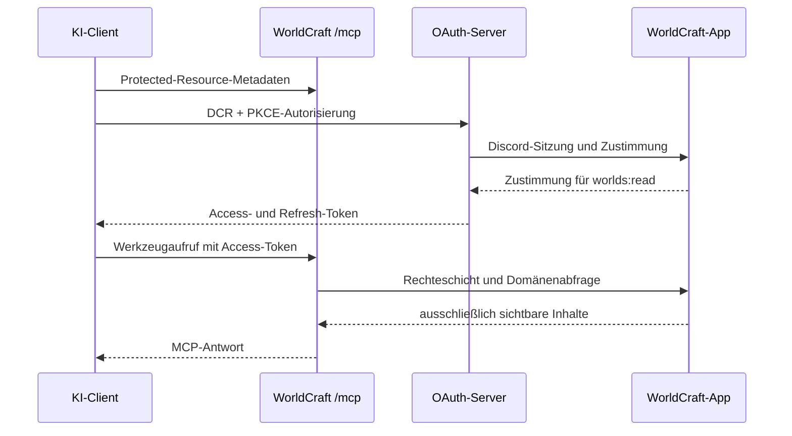

# MCP-Architektur

WorldCraft stellt unter `/mcp` einen ausschließlich lesenden Streamable-HTTP-MCP-Server bereit. Er ist nur aktiv, wenn `MCP_ENABLED=true` gesetzt ist. Zusätzlich muss die jeweilige Welt durch ihren Game Master freigegeben sein.

## Ablauf

## Token, Begrenzung und Audit

- Zugriffstoken gelten eine Stunde und sind auf die Ressource `/mcp` sowie den Scope `worlds:read` gebunden.
- Refresh-Tokens gelten 30 Tage und werden bei Verwendung rotiert.
- Vor Autorisierung, Token-Ausgabe, Refresh und jedem MCP-Aufruf wird die Discord-Allowlist geprüft.
- Pro Benutzer sind 60 Werkzeugaufrufe pro gleitender Minute zulässig. Der 61. Aufruf erhält HTTP `429` mit `Retry-After`.
- Jeder Werkzeugaufruf schreibt Zeitpunkt, Benutzer-ID, Client-ID, Werkzeugname, aufgelöste Welt-ID, Dauer und Ergebnis in das Audit-Log. Suchbegriffe, Inhalte und Bilddaten werden nie gespeichert. Einträge werden nach 30 Tagen täglich bereinigt.

## Neues MCP-Werkzeug hinzufügen

1. Scope und ausschließlich lesenden Umfang festlegen; Schreiboperationen gehören nicht in diesen Server.
2. Nur bestehende Domänen- und Rechteschicht verwenden. Das Werkzeug darf keine Tabellen direkt abfragen.
3. Sichtbarkeit, Weltfreigabe und die feste Ausschlussliste prüfen: Tagebuch, Chat, Einladungen, Koordinaten, Marker, Kartenbilder, Datei-IDs und URLs sind tabu.
4. Eingabeschema, deutschsprachige Beschreibung, Fehlertexte und Ausgabe-Begrenzung ergänzen.
5. Werkzeug über den Audit-Wrapper registrieren und keine Inhalte im Audit-Log ablegen.
6. Die lokale MCP-Suite um Rollen-, Sichtbarkeits- und Ausschlusstests erweitern und `npm run test:mcp` ausführen.
