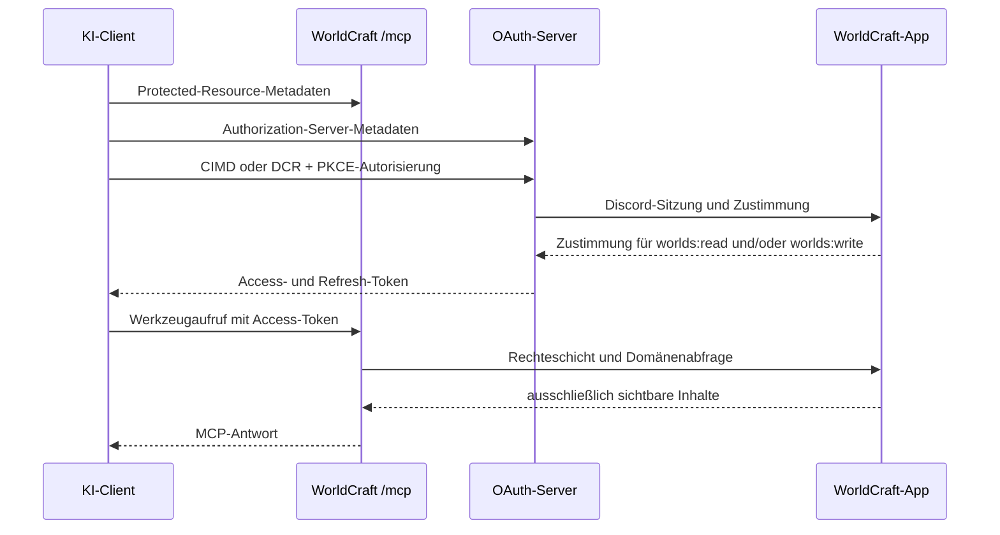
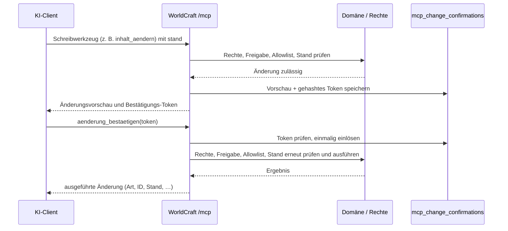

# MCP-Architektur

WorldCraft stellt unter `/mcp` einen Streamable-HTTP-MCP-Server bereit, der **lesen und schreiben** kann. Er ist nur aktiv, wenn `MCP_ENABLED=true` gesetzt ist. Zusätzlich muss die jeweilige Welt durch ihren Game Master freigegeben sein. Schreiben erfordert den Scope `worlds:write`; Lesen reicht mit `worlds:read` oder `worlds:write` (letzterer schließt Lesen ein). Gelöscht wird nie.

Fehleranalyse der Claude-Anbindung, Discovery-Pfade und Checkliste für künftige MCP-Server: [mcp-oauth-anbindung.md](mcp-oauth-anbindung.md). Entscheidungen zum Schreiben: [ADR-005 §10](../decisions/005-mcp-server.md).

## Client-Plugins (OpenAI)

Die Dateien unter `plugins/worldcraft/` ermöglichen die Ein-Klick-Einbindung in ChatGPT und Codex. Für Claude sind sie nicht nötig; Claude verbindet sich per MCP-URL (in claude.ai/Desktop als Custom Connector, in Claude Code per `claude mcp add --transport http`).

| Datei | Zweck |
|---|---|
| `plugins/worldcraft/mcp.json` | MCP-Endpunkt |
| `plugins/worldcraft/plugin.json` | Manifest nach agent-plugins.org-Schema mit Erweiterung `com.openai` |
| `plugins/worldcraft/.codex-plugin/plugin.json` | Codex-Manifest |

Die Texte `displayName`, `shortDescription`, `longDescription` und `defaultPrompt` stehen bewusst in beiden Manifesten und werden gemeinsam geändert. Die Plugin-Version folgt eigenem SemVer und ist von der App-Version unabhängig: Bei geänderten Texten oder Fähigkeiten steigt die Minor-Version, bei Korrekturen die Patch-Version.

## Ablauf (OAuth und Lesen)

## Bestätigungsablauf (Schreiben)

Bestätigungspflichtige Änderungen (bestehender Inhalt, Sichtbarkeit, Stub-Anlage, Bild-Ersetzen) werden nicht sofort ausgeführt. Das Schreibwerkzeug liefert eine Änderungsvorschau und ein Bestätigungs-Token; erst `aenderung_bestaetigen` führt aus. Tokens liegen nur gehasht in `mcp_change_confirmations`, sind 10 Minuten gültig und einmal einlösbar.

## Upload-Link

`bild_hochladen` erzeugt einen einmaligen Upload-Link unter `/upload/<ticket>` (15 Minuten, gehasht in `mcp_upload_tickets`). `GET` zeigt eine Upload-Seite für den Browser; `POST` mit `multipart/form-data` ohne Cookie speichert die Datei (gleiche Größen-/Typprüfung wie der App-Upload) und setzt das Bild am Ziel. Claude Code kann per `curl -F` selbst hochladen; in claude.ai öffnet der Benutzer den Link. Ersetzen eines vorhandenen Bildes braucht zuvor die Bestätigung. Upload-Einlösungen sind zusätzlich auf 10 pro Minute und Ticket-Besitzer begrenzt.

## Token, Begrenzung und Audit

- Zugriffstoken gelten eine Stunde und sind auf die Ressource `/mcp` sowie den Scope `worlds:read` und/oder `worlds:write` gebunden. `worlds:write` schließt Lesen ein; reine Lese-Zustimmungen werden bei Anfrage von `worlds:write` nicht still erweitert.
- Refresh-Tokens gelten 30 Tage und werden bei Verwendung rotiert.
- Vor Autorisierung, Token-Ausgabe, Refresh und jedem MCP-Aufruf wird die Discord-Allowlist geprüft.
- Pro Benutzer sind 60 Werkzeugaufrufe pro gleitender Minute zulässig. Der 61. Aufruf erhält HTTP `429` mit `Retry-After`.
- Jeder Werkzeugaufruf schreibt Zeitpunkt, Benutzer-ID, Client-ID, Werkzeugname, aufgelöste Welt-ID, Dauer und Ergebnis in das Audit-Log. Schreibvorgänge ergänzen Ziel-Art, Ziel-ID, Bestätigungsstatus und Herkunft `mcp`. Suchbegriffe, Inhalte und Bilddaten werden nie gespeichert. Einträge werden nach 30 Tagen täglich bereinigt; abgelaufene Bestätigungs- und Upload-Tokens ebenfalls.
- OAuth/DCR nutzt zusätzlich Better Auths In-Memory-Limiter pro Client-IP: `POST /oauth2/register` 5 pro 60 s, `/oauth2/authorize` und `/oauth2/token` je 30 pro 60 s; sonst 100 pro 10 s. Er ist auch lokal aktiv, damit die Integrationstests die Grenzen belegen. Coolify muss einen einzelnen vertrauenswürdigen `x-forwarded-for`-Wert weiterreichen; ein direkter Zugriff auf den Container ist nicht zulässig.
- CIMD verwendet den Node-Transport von `@better-auth/cimd`: HTTPS-only, DNS-Auflösung genau einmal, ausschließlich öffentlich routbare Adressen, gepinnte Verbindung und keine Redirects. Better Auth begrenzt den Dokumentabruf zusätzlich auf 5 KB und 5 s. WorldCraft pinnt die Revalidierung auf höchstens 15 Minuten und erneute Fehlversuche auf frühestens eine Minute.

## Neues MCP-Werkzeug hinzufügen

1. Scope festlegen: Lesewerkzeuge akzeptieren `worlds:read` oder `worlds:write`; Schreibwerkzeuge verlangen zusätzlich `worlds:write` und setzen `readOnlyHint: false` (bei Bestätigungspflicht auch `destructiveHint: true`).
2. Nur bestehende Domänen- und Rechteschicht verwenden. Das Werkzeug darf keine Tabellen direkt abfragen.
3. Sichtbarkeit, Weltfreigabe und die feste Ausschlussliste prüfen: Tagebuch, Chat, Einladungen, Koordinaten, Marker, Kartenbilder, Datei-IDs und URLs sind tabu. Pins und Charaktere sind vom Schreiben ausgeschlossen.
4. **Schreiben:** Kein Löschen. Neue Inhalte starten mit `nur ich` (Universen: `nur Spielleitung`). Änderungen an bestehendem Inhalt, Sichtbarkeit und Stub-Anlage laufen über den Bestätigungsablauf; Stand-Prüfung ist Pflicht.
5. Eingabeschema, deutschsprachige Beschreibung, Fehlertexte und Ausgabe-Begrenzung ergänzen.
6. Werkzeug über den Audit-Wrapper registrieren; bei Schreiben Ziel-Art/-ID und Bestätigungsstatus setzen, keine Inhalte im Audit-Log ablegen.
7. Die lokale MCP-Suite um Rollen-, Sichtbarkeits-, Ausschluss- und ggf. Bestätigungstests erweitern und `npm run test:mcp` ausführen.
