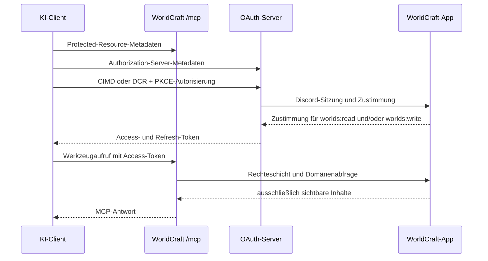
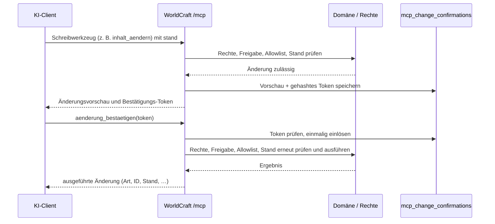

# MCP-Architektur

WorldCraft stellt unter `/mcp` einen Streamable-HTTP-MCP-Server bereit, der **lesen und schreiben** kann. Er ist nur aktiv, wenn `MCP_ENABLED=true` gesetzt ist. Zusätzlich muss die jeweilige Welt durch ihren Game Master freigegeben sein. Schreiben erfordert den Scope `worlds:write`; Lesen reicht mit `worlds:read` oder `worlds:write` (letzterer schließt Lesen ein). Gelöscht wird nie.

Fehleranalyse der Claude-Anbindung, Discovery-Pfade und Checkliste für künftige MCP-Server: [mcp-oauth-anbindung.md](mcp-oauth-anbindung.md). Entscheidungen zum Schreiben: [ADR-005 §10](../decisions/005-mcp-server.md).

## Client-Plugins (OpenAI)

Die Dateien unter `plugins/worldcraft/` ermöglichen die Ein-Klick-Einbindung in ChatGPT und Codex. Für Claude sind sie nicht nötig; Claude verbindet sich per MCP-URL (in claude.ai/Desktop als Custom Connector, in Claude Code per `claude mcp add --transport http`).

| Datei | Zweck |
|---|---|
| `plugins/worldcraft/mcp.json` | MCP-Endpunkt |
| `plugins/worldcraft/plugin.json` | Manifest nach agent-plugins.org-Schema mit Erweiterung `com.openai` |
| `plugins/worldcraft/.codex-plugin/plugin.json` | Codex-Manifest |

Die Texte `displayName`, `shortDescription`, `longDescription` und `defaultPrompt` stehen bewusst in beiden Manifesten und werden gemeinsam geändert. Die Plugin-Version folgt eigenem SemVer und ist von der App-Version unabhängig: Bei geänderten Texten oder Fähigkeiten steigt die Minor-Version, bei Korrekturen die Patch-Version.

## Ablauf (OAuth und Lesen)

## Bestätigungsablauf (Schreiben)

Bestätigungspflichtige Änderungen (bestehender Inhalt, Sichtbarkeit, Stub-Anlage, Bild-Ersetzen) werden nicht sofort ausgeführt. Das Schreibwerkzeug liefert eine Änderungsvorschau und ein Bestätigungs-Token; erst `aenderung_bestaetigen` führt aus. Tokens liegen nur gehasht in `mcp_change_confirmations`, sind 10 Minuten gültig und einmal einlösbar.

## Upload-Link

`bild_hochladen` erzeugt einen einmaligen Upload-Link unter `/upload/<ticket>` (15 Minuten, gehasht in `mcp_upload_tickets`). `GET` zeigt eine Upload-Seite für den Browser; `POST` mit `multipart/form-data` ohne Cookie speichert die Datei (gleiche Größen-/Typprüfung wie der App-Upload) und setzt das Bild am Ziel. Claude Code kann per `curl -F` selbst hochladen; in claude.ai öffnet der Benutzer den Link. Ersetzen eines vorhandenen Bildes braucht zuvor die Bestätigung. Upload-Einlösungen sind zusätzlich auf 10 pro Minute und Ticket-Besitzer begrenzt.

## Token, Begrenzung und Audit

- Zugriffstoken gelten eine Stunde und sind auf die Ressource `/mcp` sowie den Scope `worlds:read` und/oder `worlds:write` gebunden. `worlds:write` schließt Lesen ein; reine Lese-Zustimmungen werden bei Anfrage von `worlds:write` nicht still erweitert.
- Refresh-Tokens gelten 30 Tage und werden bei Verwendung rotiert.
- Vor Autorisierung, Token-Ausgabe, Refresh und jedem MCP-Aufruf wird die Discord-Allowlist geprüft.
- Pro Benutzer sind 60 Werkzeugaufrufe pro gleitender Minute zulässig. Der 61. Aufruf erhält HTTP `429` mit `Retry-After`.
- Jeder Werkzeugaufruf schreibt Zeitpunkt, Benutzer-ID, Client-ID, Werkzeugname, aufgelöste Welt-ID, Dauer und Ergebnis in das Audit-Log. Schreibvorgänge ergänzen Ziel-Art, Ziel-ID, Bestätigungsstatus und Herkunft `mcp`. Suchbegriffe, Inhalte und Bilddaten werden nie gespeichert. Einträge werden nach 30 Tagen täglich bereinigt; abgelaufene Bestätigungs- und Upload-Tokens ebenfalls.
- OAuth/DCR nutzt zusätzlich Better Auths In-Memory-Limiter pro Client-IP: `POST /oauth2/register` 5 pro 60 s, `/oauth2/authorize` und `/oauth2/token` je 30 pro 60 s; sonst 100 pro 10 s. Er ist auch lokal aktiv, damit die Integrationstests die Grenzen belegen. Coolify muss einen einzelnen vertrauenswürdigen `x-forwarded-for`-Wert weiterreichen; ein direkter Zugriff auf den Container ist nicht zulässig.
- CIMD verwendet den Node-Transport von `@better-auth/cimd`: HTTPS-only, DNS-Auflösung genau einmal, ausschließlich öffentlich routbare Adressen, gepinnte Verbindung und keine Redirects. Better Auth begrenzt den Dokumentabruf zusätzlich auf 5 KB und 5 s. WorldCraft pinnt die Revalidierung auf höchstens 15 Minuten und erneute Fehlversuche auf frühestens eine Minute.

## Schema von `felder` (Plan 012 T-004)

**Entscheidung (2026-09-29): `anyOf`-Union, kein Fallback.** `felder` von `inhalt_anlegen` und `inhalt_aendern` ist eine `anyOf`-Union aus einem strikten Objekt je `art` (`additionalProperties: false`, Beschreibung „Felder für art = <art>.“), erzeugt aus dem Feldkatalog (`src/lib/mcp/field-catalog.ts`) in `src/lib/mcp/tools/write-schemas.ts`. `vorlagenfelder` ist ebenso eine Union aus einem strikten Objekt je Vorlagentyp mit den deutschen Labels als Schlüssel; `charakterblatt` ein striktes Objekt mit den MCP-Schlüsseln.

- **Begründung:** Der Plan-Fallback (ein einzelnes Objekt mit allen Schlüsseln aller Arten) war nur für den Fall vorgesehen, dass Clients die Union nicht darstellen. Der Test mit dem echten Client (Claude Code gegen den lokalen Server) wurde auf Wunsch des Projektinhabers übersprungen; die Prüfung mit echten Clients holt E2E-Lauf 2 (Plan 012 T-013) in claude.ai und Claude Code nach. Scheitert ein Client dort an der Union, wird auf den Fallback umgestellt.
- **Pflichtfelder:** Beim Anlegen sind nur die Katalogfelder mit „Pflicht beim Anlegen“ `required`, beim Ändern ist jedes Feld optional.
- **Feste Enums (E5):** `vorlagentyp` und Quest-/Kapitel-`status` sind im Schema `enum`; übrige Auswahlwerte nennen die erlaubten Werte nur in der Beschreibung und werden im Handler geprüft.
- **Englische Schlüssel (E5):** Registry-Schlüssel der Vorlagenfelder (z. B. `rarity`), abweichende Groß-/Kleinschreibung der Labels und englische Charakterblatt-Schlüssel werden vor der strikten Prüfung per `z.preprocess` auf den beworbenen Schlüssel abgebildet. Sie erscheinen deshalb nicht im veröffentlichten Schema, werden beim Schreiben aber weiter angenommen.
- **Fehler:** Das SDK prüft `felder` vor dem Handler, ohne `art` zu kennen. Passt `felder` zu keiner Art, nennt der Fehler die gültigen Schlüssel je `art`. Passt `felder` zu einer anderen Art (z. B. `seltenheit` am Artikel), lehnt der Handler strikt ab und nennt die gültigen Felder der angefragten Art. Feinere Meldungen je Feld folgen mit T-005.
- **Keine Änderung:** Ergibt eine Änderung gegenüber dem gelesenen Stand kein Delta, antwortet `inhalt_aendern` mit „Keine Änderung: Die übergebenen Werte entsprechen dem aktuellen Stand.“ und erzeugt kein Bestätigungs-Token.
- Alle `inputSchema` aller Werkzeuge sind strikt, auch verschachtelte Objekte (`quelle`, `ziel`) und `welten_auflisten` (leeres striktes Objekt).

## Neues MCP-Werkzeug hinzufügen

1. Scope festlegen: Lesewerkzeuge akzeptieren `worlds:read` oder `worlds:write`; Schreibwerkzeuge verlangen zusätzlich `worlds:write` und setzen `readOnlyHint: false` (bei Bestätigungspflicht auch `destructiveHint: true`).
2. Nur bestehende Domänen- und Rechteschicht verwenden. Das Werkzeug darf keine Tabellen direkt abfragen.
3. Sichtbarkeit, Weltfreigabe und die feste Ausschlussliste prüfen: Tagebuch, Chat, Einladungen, Koordinaten, Marker, Kartenbilder, Datei-IDs und URLs sind tabu. Pins und Charaktere sind vom Schreiben ausgeschlossen.
4. **Schreiben:** Kein Löschen. Neue Inhalte starten mit `nur ich` (Universen: `nur Spielleitung`). Änderungen an bestehendem Inhalt, Sichtbarkeit und Stub-Anlage laufen über den Bestätigungsablauf; Stand-Prüfung ist Pflicht.
5. Eingabeschema, deutschsprachige Beschreibung, Fehlertexte und Ausgabe-Begrenzung ergänzen.
6. Werkzeug über den Audit-Wrapper registrieren; bei Schreiben Ziel-Art/-ID und Bestätigungsstatus setzen, keine Inhalte im Audit-Log ablegen.
7. Die lokale MCP-Suite um Rollen-, Sichtbarkeits-, Ausschluss- und ggf. Bestätigungstests erweitern und `npm run test:mcp` ausführen.

## Eingabe-Inventur (Plan 012)

**Stand:** vor T-003 bis T-008, erhoben am 2026-09-29. S = Schlüssel im
Werkzeug-Schema sichtbar; W = erlaubte Werte sichtbar; U = Verhalten bei
unbekanntem Schlüssel; F = Fehler bei ungültigem Wert; L = wieder lesbar
(auch leer); D = Vorschau/Quittung mit deutschem Label und Titel statt ID.
Alle obersten Objekte sind noch nicht strikt: unbekannte Parameter werden
entfernt (B7 → T-004).

**Werte-Legende:** Art = artikel, quest, charakter, pin, monster, universum;
Vorlage = person, ort, organisation, gegenstand, rasse, ohne; Status = offen,
aktiv, abgeschlossen, gescheitert; Sichtbarkeit = nur ich, nur Spielleitung,
veröffentlicht; Monster-Art = Bestie, Untoter, Dämon, Drache, Humanoid,
Konstrukt, Aberration, Pflanze, Magisch, sonstiges; Seltenheit = Gewöhnlich,
Ungewöhnlich, Selten, Episch, Legendär; Gefahr = Harmlos, Gefährlich,
Tödlich, Verheerend, Göttlich, Apokalyptisch; Größe = Winzig, Klein,
Durchschnitt, Groß, Gigantisch.

| Werkzeug | Jede Eingabe | S/W | U/F | L/D | Befund → Aufgabe |
|---|---|---|---|---|---|
| welten_auflisten | keine | – | – | ja/– | – |
| suchen | welt, suchbegriff, art (Art), limit (1–50) | ja/ja | entfernt/teils allgemein | ja/– | B3, B7 → T-004/T-005 |
| inhalte_auflisten | welt, art (artikel/monster), vorlagentyp (Vorlage), monster_art (Monster-Art), quest_gegenstand (Ja/Nein), limit (1–200) | ja/teils | entfernt/teils allgemein | ja/– | B1, B3, B7 → T-003–T-005 |
| inhalt_lesen | welt, art (Art), id | ja/ja | entfernt/teils allgemein | nein bei leeren Vorlagenfeldern/nein | B3, B4, B7, B8 → T-004–T-006 |
| relationen_abrufen | welt, art (Art), id, tiefe (1/2) | ja/ja | entfernt/teils allgemein | ja/– | B3, B7 → T-004/T-005 |
| quests_auflisten | welt, status (Status) | ja/ja | entfernt/teils allgemein | ja/– | B3, B7 → T-004/T-005 |
| universen_auflisten | welt | ja/n/a | entfernt/teils allgemein | ja/– | B3, B7 → T-004/T-005 |
| bild_lesen | welt, art (welt/artikel/charakter/monster), id, bild_nr (1–10) | ja/ja | entfernt/teils allgemein | ja/– | B3, B7 → T-004/T-005 |
| aenderung_bestaetigen | token | ja/n/a | entfernt/teils allgemein | ja/nein | B3, B5/B6, B7 → T-004/T-005/T-008 |
| sichtbarkeit_setzen | welt, art (artikel/quest/kapitel/monster/universum), id, stand, sichtbarkeit (Sichtbarkeit) | ja/ja | entfernt/teils allgemein | ja/nein | B3, B5/B6, B7 → T-004/T-005/T-008 |
| bild_hochladen | welt, ziel (welt/artikel/monster), id, stand | ja/ja | entfernt/teils allgemein | ja/nein | B3, B5/B6, B7 → T-004/T-005/T-008 |
| relation_anlegen | welt, quelle.art, quelle.id, ziel.art, ziel.id, bezeichnung, gegenbezeichnung | ja/ja | entfernt, auch verschachtelt/teils allgemein | ja/nein; IDs statt Titel | B3, B6, B7 → T-004/T-005/T-008 |

### Inhalt anlegen und ändern

Welt, Art sowie beim Ändern ID, Stand und Modus (anhaengen/ersetzen) sind
sichtbar. Felder ist ein freies Objekt: seine Schlüssel und Werte sind nicht
sichtbar (B1); unbekannte Felder liefern nicht durchgängig Pfad und zulässige
Alternativen (B2/B3). Jede Zeile hat daher im Ist-Stand S/W nein und U/F
unvollständig; T-003 bis T-005 beheben das.

| Art | Jedes Feld | L/D | Befund → Aufgabe |
|---|---|---|---|
| artikel | titel, vorlagentyp (Vorlage), vorlagenfelder (20 Zeilen unten), text; beim Anlegen sichtbarkeit (wird ignoriert) | leere Vorlagenfelder nein/nein | B1, B2, B4–B6 → T-003–T-008 |
| quest | titel, status (Status), beschreibung, beteiligte (Charakter-IDs); beim Anlegen sichtbarkeit | Beteiligte nicht rückschreibbar/nein | B1, B5/B6, B8 → T-003–T-008 |
| kapitel | quest_id (nur Anlegen), titel, status (Status), text, position; beim Anlegen sichtbarkeit | ja/nein | B1, B5/B6 → T-003–T-008 |
| notizblock | text | ja/nein | B1/B2 (Fehlgriff inhalt), B5/B6 → T-003–T-008 |
| monster | name, monster_art (Monster-Art), seltenheit (Seltenheit), boss, gefahr (Gefahr), groesse (Größe), lebensraum, charakterblatt, bio; beim Anlegen sichtbarkeit | Lebensraum nur Titel/ID; nein | B1, B5/B6, B8 → T-003–T-008 |
| universum | name, beschreibung; beim Anlegen sichtbarkeit | ja/nein | B1, B5/B6 → T-003–T-008 |
| welt | name, beschreibung | ja/nein | B1, B5/B6 → T-003–T-008 |

### Vorlagenfelder (20 Registry-Felder)

Für jede der folgenden Zeilen gilt: S/W nein, U/F unvollständig, L bei leerem
Wert nein, D nein (B1–B6 → T-003–T-008).

| Vorlage | Deutsches Label | Typ / erlaubte Werte oder Verweisziel |
|---|---|---|
| Person | Andere Namen; Beruf / Rolle; Rasse; Status; Aufenthaltsort; Organisation | Text; Text; Rasse-Artikel; lebendig/kampfunfähig/versiegelt/tot/verschollen/unbekannt; Ort-Artikel; Organisations-Artikel |
| Ort | Art; Gefahrenstufe; Ruf; Herrscher; Übergeordneter Ort | Stadt/Dorf/Gebäude/Kontinent/Region/Dungeon/Wildnis/Ebene/sonstiges; Harmlos/Gefährlich/Tödlich; Gehasst/Verrufen/Neutral/Akzeptiert/Geliebt; Person-Artikel; Ort-Artikel |
| Organisation | Art; Größe; Gefahrenstufe; Anführer; Sitz | Gilde/Religion/Adelshaus/Freie Kompanie/Staat/Kult/sonstiges; 1–10/11–50/51–100/101+; Gefahr; Person-Artikel; Ort-Artikel |
| Gegenstand | Art; Seltenheit; Besitzer; Quest-Gegenstand | Waffe/Rüstung/Artefakt/Relikt/alltäglich/Fisch/Pflanze/sonstiges; Seltenheit; Person-Artikel oder Charakter; Ja/Nein |
| Rasse | keine | – |

### Monster-Charakterblatt und Auswahlwerte

Die vollständigen Unterfelder sind klasse (Text), attribute (STR/GES/KON/INT/WEI/CHA
mit Zahl), uebungsbonus (Zahl), fertigkeiten (name, stufe Ungeübt/Geübt/Experte,
attribut), faehigkeiten (text, attribut), persoenlichkeit, ideale, bindungen
und schwaechen (je Text). Für jedes gelten S/W nein, U/F B1–B3, L ja und D B8;
T-003 bis T-008 beheben das. Damit sind auch Vorlagen-Verweise samt Relation,
lebensraum, beteiligte, Sichtbarkeit, Upload-Ziel und sämtliche Lesefilter
erfasst. Es gibt keine Abweichung außerhalb B1–B8; ein B9 ist nicht angelegt.
